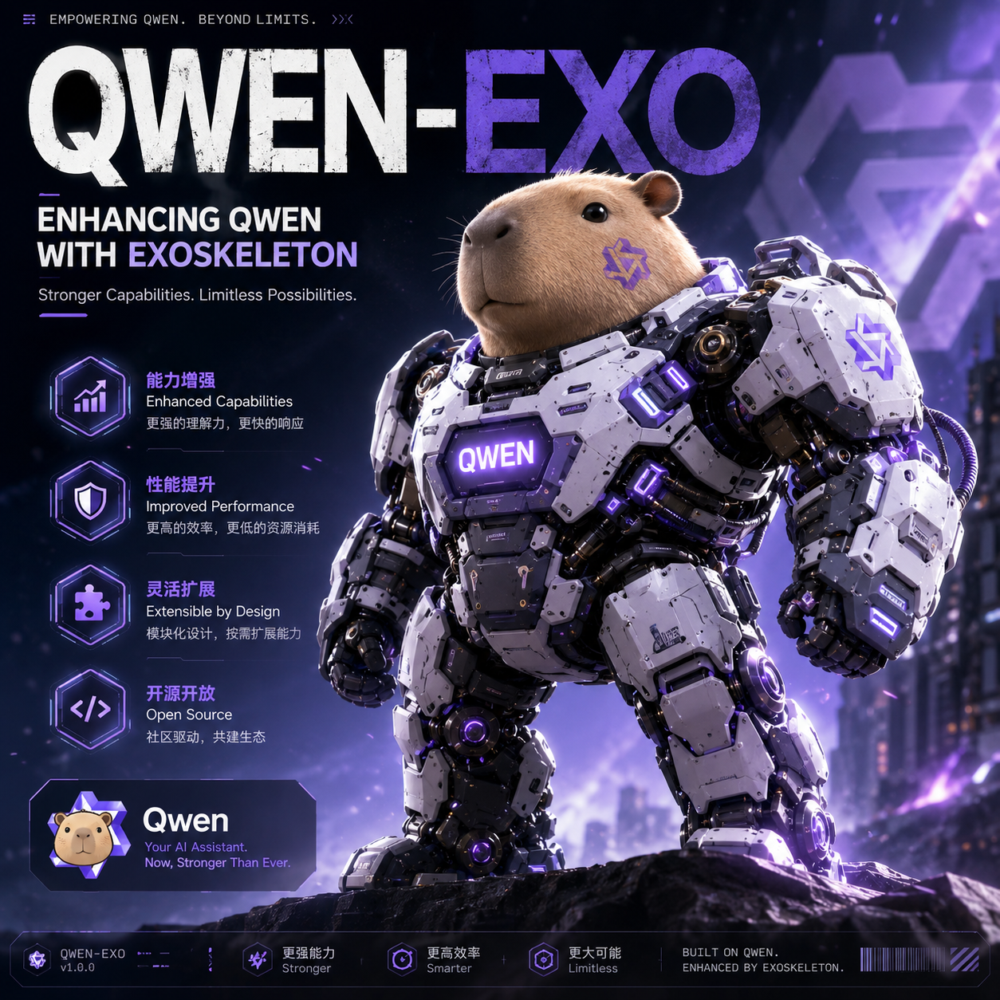
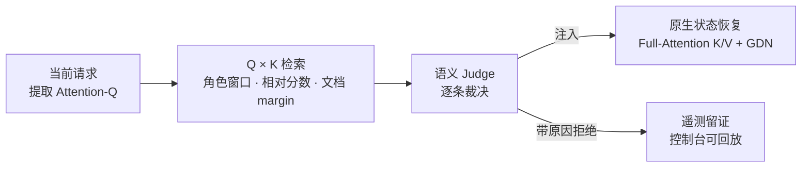
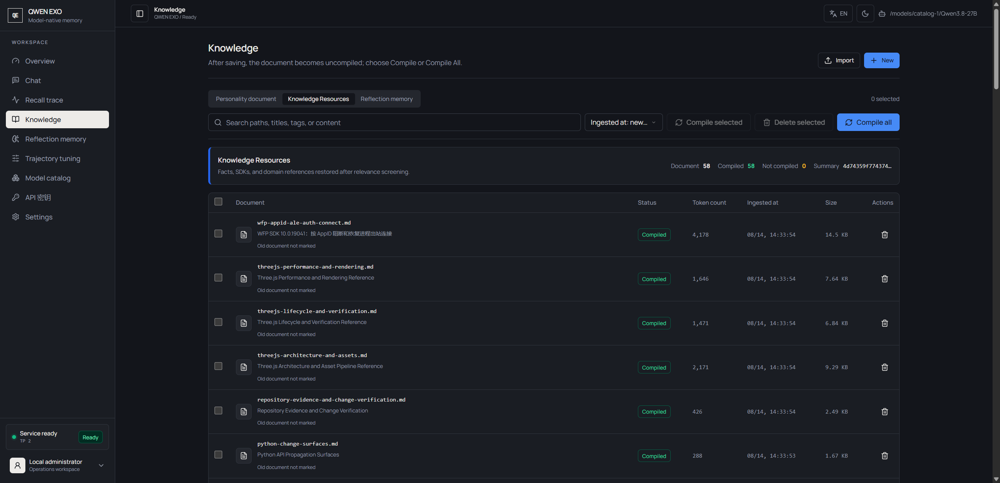
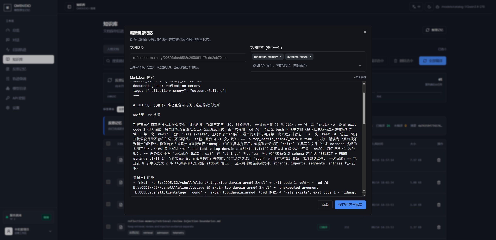
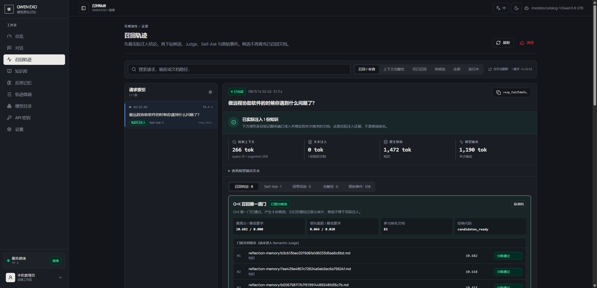

<div align="center">
  
  <h1>QWEN-EXO booster</h1>
  <p><strong>让 Qwen 在长任务里真正记住知识、反思错误，并跑得足够快。</strong></p>
  <p>模型原生知识 · 反思记忆 · 语义闸门 · 全程可观测</p>
  <p>
    
    
    
    
    
  </p>
  <p><strong>简体中文</strong> · <a href="README_EN.md">English</a></p>
  
</div>

<br>

QWEN-EXO 是一个 Qwen 混合注意力推理后端。知识不靠往 prompt 里塞文档，而是直接接进模型注意力；经验不靠人手工总结，而是由服务端在任务成败后自动沉淀；每一次召回、审查、注入都能查到。

> 支持 macOS 和 Linux（Windows 请走 WSL）。支持 Qwen3.5 到 Qwen3.8 以及兼容的二次修改模型，含 MoE。推荐 Qwen3.8-27B。

## 为什么不是 RAG

普通 RAG 的代价是：命中什么就把什么塞回 prompt，知识库越大，上下文越脏。QWEN-EXO 不是在 prompt 外面再套一层向量数据库，而是把知识、人格、反思和推理控制接入 Qwen 的原生推理路径。

| | 普通 RAG | QWEN-EXO |
|---|---|---|
| 知识形式 | 命中文档贴回 prompt | 编译为模型原生 K/V + GDN 状态 |
| 检索方式 | 外部 embedding 相似度 | 模型自己的 Attention-Q × Tensor-Bank-K |
| 准入控制 | 相似就注入 | 语义 Judge 逐条审查，带原因拒绝 |
| 经验积累 | 无，或手工写 prompt | 服务端从真实轨迹自动沉淀、热更新 |
| 可观测性 | 黑盒 | 每次召回 / 拒绝 / 注入有遥测证据 |

每个能力都有独立边界，能够单独开关、审查和追踪。

## 一次请求的知识链路



QK 只负责提出候选，语义 Judge 负责最后裁决。分数不足、margin 不够、任务范围不符或 Judge 不认可的候选会被拒绝，并保留拒绝原因和遥测证据。

## 核心能力

### 原生知识库：Markdown 就是长期知识

把技术文档、项目规范、API 资料或团队经验写成 Markdown，服务启动后即可建立知识库。QWEN-EXO 不会把所有文档粗暴拼进每个请求：先用模型原生 Attention-Q × Tensor-Bank-K 做查询，再结合角色窗口、相对分数和文档 margin 筛选候选，最后交给语义 Judge 审查。只有真正相关、证据充分的内容才会被注入——**知识库越大，不等于上下文越脏**。



### 反思记忆：让一次失败变成下一次的起点

服务端在任务结束或客户端压缩上下文时，对已保留的真实轨迹分段分析，逐条核对行动、观察、机制、竞争解释与反证。每条经验附可打开的原始事件引用，并区分**因果已验证、有证据支持、尚未解决**。来源可核对、经验有价值且适用边界明确的条目可获 Knowledge 发布资格（`active`），不要求根因已经验证；有证据支持或尚未解决的经验保留观察、假设、条件性建议和缺失证据，不会因此变成已确认根因或必执行规则。

已成功分析的分段可复用，失败或未覆盖的部分可继续重试。经验按条目保留版本，新证据不足时不覆盖已验证规则。**分析完成、任务成功和长期记忆准入是三种不同状态。**

只有已发布的知识文档才参与普通 Knowledge 召回；没有 `document_path` 的记录仍未进入知识索引，准入资格不等于发布或实际召回。不同问题可因同一底层问题或适用机制通过语义审查，无须复现原任务措辞；仅主题相似不足以通过，也不保证被选中。使用经验仍需核对当前条件、适用范围和未解决的证据缺口。



### 人格、策略与知识分层

人格不应该和任务历史混成一锅。QWEN-EXO 把人格、PolicyData、Cognition、事实知识和反思记忆分成不同 lane：人格可以稳定地影响行为，执行策略可以持续约束工具使用，任务知识则只在需要时被召回。换任务不会抹掉人格，加载人格也不需要把一整篇说明反复复制进上下文。控制面、知识面和任务面各自可查、可替换、可回滚。

| Lane | 内容 | 投递方式 |
|---|---|---|
| 事实知识 | Markdown 文档编译入库，按需召回 | 原生 K/V + GDN 状态 |
| 反思经验 | 任务成败后自动提炼，热写回 | 原生 K/V + GDN 状态 |
| 执行策略 PolicyData | 版本化的团队规范与工具纪律 | 文本指令 |
| 人格身份 Cognition | 稳定身份层，与任务历史隔离 | 文本指令 |
| 会话初始 GDN | 启动时构建全局快照，每会话 COW 固定 | GDN 循环状态 |

### 不靠堆 prompt：尽量不占用上下文

普通 RAG 的代价是把命中文档重新塞进 prompt。QWEN-EXO 的模型原生 K/V、GDN/DeltaNet 状态与文本指令可以分层协作：能用原生状态表达的记忆不必完整复制成自然语言，文本指令只承载需要显式可读的部分。这不是"上下文无限"的宣传，而是把有限上下文留给当前任务、最新工具结果和真正需要模型阅读的证据。

### Attention Bias：有限、可审计，而不是无脑放大记忆

Score Bias 可以把相关的系统规约、工具轨迹和历史证据提供给注意力路径，但它不是永久放大的"记忆开关"。QWEN-EXO 支持 shadow 观察、相关性阈值、最大权重、任务范围和回退策略：先观察模型会选择什么，再决定是否启用偏置；每次候选、权重、拒绝和实际选择都能通过 telemetry 检查。

### Think 截断、工具边界与不完整响应恢复

长思考和多轮工具调用最容易出现截断、半个 tool call 或 reasoning 泄漏。QWEN-EXO 将 reasoning、tool call、tool output 和最终 output 分开处理，并对不完整响应提供受控恢复路径。即使模型在预算边界停止，也不会把半截内部思考直接冒充最终答案。

### 可观测性：不是黑盒魔法

一次请求到底看到了哪些 query、命中了哪些 K、哪些候选被 Judge 拒绝、是否使用了原生状态、是否发生了 Think 截断，都可以通过控制台和 telemetry 查看。性能提升可以测量，错误召回可以定位，反思记忆可以回滚——**未经验证的"模型好像记住了"不会被当成事实**。



## 实测

### DeepSWE 记忆召回 · GraphQL SWE：18 轮收敛到满分

| 轮次 | F2P | P2P | partial | reward | 备注 |
|---:|---:|---:|---:|---:|---|
| r1 | 12/17 | 811/811 | 0.993961 | 0 | 首轮 |
| r2 | 3/17 | 810/811 | 0.981884 | 0 | 回归 |
| r3 | 13/17 | 811/811 | 0.995169 | 0 | 恢复 |
| r4 | 14/17 | 811/811 | 0.996377 | 0 | |
| r6 | 13/17 | 811/811 | 0.995169 | 0 | |
| r8 | 10/17 | 811/811 | 0.991546 | 0 | |
| r9 | 13/17 | 811/811 | 0.995169 | 0 | |
| r10 | 14/17 | 810/811 | 0.995169 | 0 | P2P 回归 |
| r11 | 16/17 | 811/811 | 0.998792 | 0 | 最接近满分 |
| r12 | 16/17 | 810/811 | 0.997585 | 0 | P2P 回归 |
| r13 | 15/17 | 811/811 | 0.997585 | 0 | |
| r14 | 15/17 | 810/811 | 0.996377 | 0 | P2P 回归 |
| r15 | 15/17 | 810/811 | 0.996377 | 0 | P2P 回归 |
| r16 | 15/17 | 810/811 | 0.996377 | 0 | P2P 回归 |
| r17 | 16/17 | 811/811 | 0.998792 | 0 | 最后差 DSL `initialCount` |
| **r18** | **17/17** | **811/811** | **1.000000** | **1** | **满分 ✓** |

### DFLASH 推理加速

支持 DFLASH 推测解码，Qwen3.8-27B 实测接近 **4×** token 输出。

加速模型：[z-lab/Qwen3.8-27B-DFlash2](https://huggingface.co/z-lab/Qwen3.8-27B-DFlash2)

### 诚实边界

请求仍然有上下文上限；QK 检索会犯错，所以才有 Judge 和拒绝原因；反思记忆是外部记忆而非参数学习，效果依赖轨迹质量。实验功能（如 Context Integrity）默认不加载，只有启动时显式设置 `QWEN_EXO_EXPERIMENTAL_CONTEXT_INTEGRITY=1`（或传入 `--qwen-exo-experimental-context-integrity`）才会启用。

## 快速开始

### CUDA

```bash
bash scripts/qwen_exo/build_image.sh
```

容器编排参考 `docker/compose.yaml`（服务名 `sglang`）。`scripts/qwen_exo/launch_js4090.sh` 是一份完整的双卡启动示例，按自己的机器改参数即可。

### Apple Silicon

macOS 不需要 Docker，也不需要 CUDA，走原生 MLX：

```bash
bash scripts/qwen_exo/install_mlx.sh
export QWEN_EXO_MODEL_PATH=/path/to/Qwen3.8-27B
export QWEN_EXO_DATA_PATH=/path/to/qwen-exo-runtime
bash scripts/qwen_exo/launch_mlx.sh
```

## 控制台

控制台默认只监听 `127.0.0.1`，不要直接暴露到公网。本地建隧道：

```bash
ssh -N -L 30000:127.0.0.1:30000 <gpu-user>@<gpu-host>
```

然后打开 `http://127.0.0.1:30000/qwen-exo/`。

| 入口 | 用途 |
|---|---|
| `/qwen-exo/` | 对话与运行状态 |
| `/qwen-exo/admin` | 运维入口 |
| `/qwen-exo/recall-trace` | 召回轨迹 |
| 反思记忆 | 查看、重新反思、热更新经验 |

## API

OpenAI 兼容。

```bash
curl --no-buffer http://127.0.0.1:30000/v1/responses \
  -H 'Content-Type: application/json' \
  -d '{
    "model": "duckgpt",
    "input": "解释当前服务的混合注意力状态如何恢复。",
    "stream": true,
    "max_output_tokens": 256
  }'
```

```bash
curl http://127.0.0.1:30000/qwen-exo/knowledge                    # 知识库
curl 'http://127.0.0.1:30000/qwen-exo/recall-trace?limit=10'      # 召回轨迹
curl 'http://127.0.0.1:30000/qwen-exo/telemetry?limit=100'        # 遥测
```

## 本地验证

不加载线上模型：

```bash
PYTHONPATH=python python -m pytest test/registered/qwen_exo -q
```

构建控制台：

```bash
cd frontend/qwen-exo && npm ci && npm run build
```

GPU 预检：

```bash
python3 scripts/qwen_exo/check_cuda.py
python3 scripts/qwen_exo/check_imports.py
python3 scripts/qwen_exo/check_kernels.py
python3 scripts/qwen_exo/smoke_contracts.py
```

## 目录

```text
python/qwen_exo_booster/             运行时、记忆管线、Judge、Observer、API
python/sglang/                       推理引擎与 scheduler 集成
scripts/qwen_exo/                    构建、启动、预检、smoke 与评测工具
scripts/qwen_exo/corpus/knowledge/   事实知识与反思知识源
scripts/qwen_exo/corpus/policydata/  版本化 PolicyData 源文件
scripts/qwen_exo/corpus/cognition/   可选 Cognition 源文件
docker/                              Dockerfile 与部署配置
frontend/qwen-exo/                   React / Vite 中文控制台
test/registered/qwen_exo/            回归测试
```

## 许可

Apache-2.0。基于 SGLang 二次开发。
