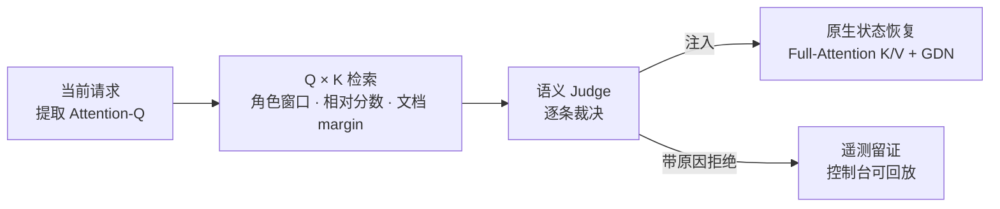

<div align="center">
  
  <h1>QWEN-EXO booster</h1>
  <p><strong>让 Qwen 在长任务里真正记住知识、反思错误，并跑得足够快。</strong></p>
  <p>模型原生知识 · 反思记忆 · 语义闸门 · 全程可观测</p>
  <p>
    
    
    
    
    
  </p>
  <p><strong>简体中文</strong> · <a href="README_EN.md">English</a></p>
  
</div>

<br>

QWEN-EXO 是一个 Qwen 混合注意力推理后端。知识不靠往 prompt 里塞文档，而是直接接进模型注意力；经验不靠人手工总结，而是由服务端在任务成败后自动沉淀；每一次召回、审查、注入都能查到。

> 支持 macOS 和 Linux（Windows 请走 WSL）。支持 Qwen3.5 到 Qwen3.8 以及兼容的二次修改模型，含 MoE。推荐 Qwen3.8-27B。

## 为什么不是 RAG

普通 RAG 的代价是：命中什么就把什么塞回 prompt，知识库越大，上下文越脏。QWEN-EXO 不是在 prompt 外面再套一层向量数据库，而是把知识、人格、反思和推理控制接入 Qwen 的原生推理路径。

| | 普通 RAG | QWEN-EXO |
|---|---|---|
| 知识形式 | 命中文档贴回 prompt | 编译为模型原生 K/V + GDN 状态 |
| 检索方式 | 外部 embedding 相似度 | 模型自己的 Attention-Q × Tensor-Bank-K |
| 准入控制 | 相似就注入 | 语义 Judge 逐条审查，带原因拒绝 |
| 经验积累 | 无，或手工写 prompt | 服务端从真实轨迹自动沉淀、热更新 |
| 可观测性 | 黑盒 | 每次召回 / 拒绝 / 注入有遥测证据 |

每个能力都有独立边界，能够单独开关、审查和追踪。

## 一次请求的知识链路


```mermaid
flowchart LR
    A["当前请求<br/>提取 Attention-Q"] --> B["Q × K 检索<br/>角色窗口 · 相对分数 · 文档 margin"]
    B --> C["语义 Judge<br/>逐条裁决"]
    C -->|注入| D["原生状态恢复<br/>Full-Attention K/V + GDN"]
    C -->|带原因拒绝| E["遥测留证<br/>控制台可回放"]
```

QK 只负责提出候选，语义 Judge 负责最后裁决。分数不足、margin 不够、任务范围不符或 Judge 不认可的候选会被拒绝，并保留拒绝原因和遥测证据。

语义审核使用固定二元读数：`A=通过`、`B=不通过`。每个候选只做一次 prefill，在同一答案位置读取两个 token 的 logprob；`log P(A) > log P(B)` 才通过（等价于二选项 softmax 的通过分数大于 0.5），平分拒绝。没有第三个语义选项，不生成审核文本/JSON，也不回退自回归 Judge。评分失败或结果错位时不注入、不缓存失败，并保留执行失败标记。多个候选独立审核，原有 Q×K 排序、范围检查及注入预算仍生效。它省去审核答案的 decode，不省去 prefill；分数不是已校准的真实正确率。反思正文和压缩摘要仍按原生成路径处理。

## 核心能力

### 原生知识库：Markdown 就是长期知识

把技术文档、项目规范、API 资料或团队经验写成 Markdown，服务启动后即可建立知识库。QWEN-EXO 不会把所有文档粗暴拼进每个请求：先用模型原生 Attention-Q × Tensor-Bank-K 做查询，再结合角色窗口、相对分数和文档 margin 筛选候选，最后交给语义 Judge 审查。只有真正相关、证据充分的内容才会被注入——**知识库越大，不等于上下文越脏**。


### 反思记忆：让一次失败变成下一次的起点

服务端在任务结束或客户端压缩上下文时，对已保留的真实轨迹分段分析，逐条核对行动、观察、机制、竞争解释与反证。每条经验附可打开的原始事件引用，并区分**因果已验证、有证据支持、尚未解决**。来源可核对、经验有价值且适用边界明确的条目可获 Knowledge 发布资格（`active`），不要求根因已经验证；有证据支持或尚未解决的经验保留观察、假设、条件性建议和缺失证据，不会因此变成已确认根因或必执行规则。

最终准入复用内部二元语义评分路径：在同一答案位置读取 `A=通过`、`B=拒绝` 的 logprob，`log P(A) > log P(B)` 才设为 `active`，平分拒绝。该评分不生成 token，不使用 JSON 结论作为准入替代；此前的结构化分析仅保留证据等级、解释和精确的合并/退休提案。`verified`、固定观察数量、空缺失证据列表和证明布尔字段不再是硬门槛。引用仍须逐字匹配真实来源，目标身份和版本仍须一致；执行失败与语义拒绝分开，失败不缓存为已审查结果。

已成功分析的分段可复用，失败或未覆盖的部分可继续重试。经验按条目保留版本；替换或退休旧条目必须把完整旧条目和变更提案一起交给二元模型审查，通过后才变更。审查策略与模型身份参与结果复用键，旧规则的缓存结论不冒充新二元审核。**分析完成、任务成功和长期记忆准入是三种不同状态。**

全局初始 GDN 纳入已准入的 `active` 反思，不再仅限 `verified`；候选和已退休条目不纳入。输入和综合反思保留证据等级、适用范围、缺失证据与条件性表述，按完整条目装入预算，不把支持性经验提升为确定因果。已有 active 记忆保留原准入来源，不伪造新二元审查记录。

只有已发布的知识文档才参与普通 Knowledge 召回；没有 `document_path` 的记录仍未进入知识索引，准入资格不等于发布或实际召回。不同问题可因同一底层问题或适用机制通过语义审查，无须复现原任务措辞；仅主题相似不足以通过，也不保证被选中。使用经验仍需核对当前条件、适用范围和未解决的证据缺口。


### 人格、策略与知识分层

人格不应该和任务历史混成一锅。QWEN-EXO 把人格、PolicyData、Cognition、事实知识和反思记忆分成不同 lane：人格可以稳定地影响行为，执行策略可以持续约束工具使用，任务知识则只在需要时被召回。换任务不会抹掉人格，加载人格也不需要把一整篇说明反复复制进上下文。控制面、知识面和任务面各自可查、可替换、可回滚。

| Lane | 内容 | 投递方式 |
|---|---|---|
| 事实知识 | Markdown 文档编译入库，按需召回 | 原生 K/V + GDN 状态 |
| 反思经验 | 任务成败后自动提炼，热写回 | 原生 K/V + GDN 状态 |
| 执行策略 PolicyData | 版本化的团队规范与工具纪律 | 文本指令 |
| 人格身份 Cognition | 稳定身份层，与任务历史隔离 | 文本指令 |
| 会话初始 GDN | 启动时构建全局快照，每会话 COW 固定 | GDN 循环状态 |

### 不靠堆 prompt：尽量不占用上下文

普通 RAG 的代价是把命中文档重新塞进 prompt。QWEN-EXO 的模型原生 K/V、GDN/DeltaNet 状态与文本指令可以分层协作：能用原生状态表达的记忆不必完整复制成自然语言，文本指令只承载需要显式可读的部分。这不是"上下文无限"的宣传，而是把有限上下文留给当前任务、最新工具结果和真正需要模型阅读的证据。

### Attention Bias：有限、可审计，而不是无脑放大记忆

Score Bias 可以把相关的系统规约、工具轨迹和历史证据提供给注意力路径，但它不是永久放大的"记忆开关"。QWEN-EXO 支持 shadow 观察、相关性阈值、最大权重、任务范围和回退策略：先观察模型会选择什么，再决定是否启用偏置；每次候选、权重、拒绝和实际选择都能通过 telemetry 检查。

### Think 截断、工具边界与不完整响应恢复

长思考和多轮工具调用最容易出现截断、半个 tool call 或 reasoning 泄漏。QWEN-EXO 将 reasoning、tool call、tool output 和最终 output 分开处理，并对不完整响应提供受控恢复路径。即使模型在预算边界停止，也不会把半截内部思考直接冒充最终答案。

### 可观测性：不是黑盒魔法

一次请求到底看到了哪些 query、命中了哪些 K、哪些候选被 Judge 拒绝、是否使用了原生状态、是否发生了 Think 截断，都可以通过控制台和 telemetry 查看。性能提升可以测量，错误召回可以定位，反思记忆可以回滚——**未经验证的"模型好像记住了"不会被当成事实**。


### 对话注意力诊断：方便 Agent 开发与排障

**调试 Agent，不必只盯着最终回答猜测。** 当你调整系统提示词、工具返回长度或历史裁剪策略时，可以导入真实会话，观察所选输入位置的 Full Attention 权重如何分布在各条消息和 token 块上，为上下文设计提供可检查的线索，再用实际任务结果验证改动。

- **导入更直接**：上传导出的对话，或从控制台选择保留的服务器会话／当前浏览器会话，无需手工拼接历史。
- **定位更细**：按消息边界或前 N tokens 选择诊断范围；逐消息权重条、分块热力图和原文视图配合查看，区分长工具输出的总占比与每 token 平均占比。
- **结论有边界**：高权重不等于模型理解了某条规则，低权重也不能证明它忽略了规则。诊断辅助提出排障假设，不代替任务验证器或端到端 A/B。

控制台的“注意力诊断”支持上传 ChatML 文本、`messages` JSON、Responses `input` 或 Completions `prompt`，先预览，再按消息边界裁剪到历史某一轮，显式点击运行。上传上限 2 MiB，裁剪后最多 32768 tokens；每次采样 1–4 个末段输入位置，默认从模型实际 Full Attention 层中均匀选择最多 4 个代表层，覆盖前段到最后层，也可手选 1–4 层。层号从 0 开始，不包含 GDN 层；层数不足 4 时选择全部可用层。结果可逐层切换查看消息／工具内容占比、每 token 平均占比和分页热图，不做跨层平均。切换查询位置保留当前观测层；色阶按当前层计算，跨层比较应以原始百分比为准。更多层会增加采样计算与结果传输量。

预览会用当前模型模板和 tokenizer 显示所选消息范围的实际 token 数及有效上限，超限时先禁用运行。可减少消息范围，或显式选择“使用前 N tokens”；即使第一条消息本身超长，也能诊断其有界前缀。token 裁剪直接保留原编码的前缀，不解码再编码、不补结束标记；页面明确显示排除的后缀数量。裁剪后的结果不是完整对话，末尾可能落在消息内部。

也可在“保留的服务器会话”或“浏览器会话”中选择最近记录，直接导入并解析预览，无需另存上传。服务器来源为保留的原始事件／轨迹，不是生成的反思经验；浏览器来源仅包含当前浏览器保存的有限历史。缺失、清理或截断的内容会标记为不完整，不伪造补齐。导入不会自动运行诊断。

诊断使用隔离的内部 target-only 请求，不执行工具、不写入反思记忆、不注入原生记忆、不训练或修改注意力偏置。原始 ChatML／completion prompt 保留所选前缀；结构化工具内容会投影成带身份的纯文本。若 JSON 消息中含多模态控制标记，会替换为惰性文本占位符并标明警告；实际图片、音频或视频不会被读取或分析，这不是原始多模态请求的精确重放。对话及分析结果不由诊断功能持久化。
原始 ChatML／completion 中若含多模态控制标记，会明确拒绝，以免破坏“保留原始前缀”的约定；请改用 `messages` JSON 做带警告的文本投影。结构化工具参数中的控制标记也会转换为惰性占位符。


热图是 post-RoPE Q 与实际缓存 K 重算的 Full Attention 估计：逐头 softmax 后平均，不覆盖 GDN，不代表理解或因果贡献；FP8 缓存量化可能使它与 fused prefill 内核使用的新鲜 K 概率不同。支持 CUDA 的 Triton／FlashInfer 标准 NHD KV 缓存及 eager prefill；不改变 decode CUDA Graph。其他拓扑、缓存或 prefill graph 模式明确返回不可用，不以检索分数替代。

分块热力图按“已采样查询位置 × 连续 token 块”展示，支持 16／64／256-token 块、总权重／每个已采样 token 的均值；同一层和分块设置下使用覆盖所有查询与块的统一色阶，翻页不重标。点击色块查看原文、实际采样数量、总量、均值和峰值，并切换对应查询的文本视图；未采样与零权重明确区分。来源统计分开列出原始正文、正文外标记文本、空白、其他未确认来源文本、跨界及无有效跨度 token，保留全部原始权重和总和检查，不把正文外文本统称为模板，也不将概率解释成理解程度或因果贡献。

接口：`POST /qwen-exo/attention-diagnostics/preview` 与 `POST /qwen-exo/attention-diagnostics/run`。该功能需要控制面和模型 worker 同时加载支持版本；仅更新静态页面不会使采样后端生效。

### 服务器会话管理

控制台“服务器会话”（`#/server-sessions`）提供按会话 ID 搜索、分页、单条删除、跨页勾选删除和清空全部。列表显示更新时间、事件数、保存载荷大小估计、快照数及忙碌状态；删除需要明确确认，清空全部不受当前搜索或分页限制。正在处理请求或写入反思来源时保守跳过忙碌会话，不中断推理。

删除范围是该会话保留的事件日志、所有来源快照及内存轨迹／待反思来源；删除后不能再从这些记录导入诊断或重新反思。已发布的反思知识、Knowledge、人格、Tensor Bank、正在服务的 Responses 状态和浏览器聊天记录保留不变。这不是遥测、分析缓存或备份的完整隐私清除；SQLite 空闲页可供后续复用，但文件不一定立即缩小。客户端后续重新发送历史时可以产生新的保存记录。

接口：`GET /qwen-exo/server-sessions?limit=25&offset=0&q=`；`POST /qwen-exo/server-sessions/delete` 接受 `{"conversation_keys":["会话 ID"]}` 或 `{"all":true}`，返回已删除、忙碌跳过和已不存在的列表。仅属于现有控制面，不对公共 `/v1` 网关开放；需要后端加载支持版本。

## 实测

### DeepSWE 记忆召回 · GraphQL SWE：18 轮收敛到满分

| 轮次 | F2P | P2P | partial | reward | 备注 |
|---:|---:|---:|---:|---:|---|
| r1 | 12/17 | 811/811 | 0.993961 | 0 | 首轮 |
| r2 | 3/17 | 810/811 | 0.981884 | 0 | 回归 |
| r3 | 13/17 | 811/811 | 0.995169 | 0 | 恢复 |
| r4 | 14/17 | 811/811 | 0.996377 | 0 | |
| r6 | 13/17 | 811/811 | 0.995169 | 0 | |
| r8 | 10/17 | 811/811 | 0.991546 | 0 | |
| r9 | 13/17 | 811/811 | 0.995169 | 0 | |
| r10 | 14/17 | 810/811 | 0.995169 | 0 | P2P 回归 |
| r11 | 16/17 | 811/811 | 0.998792 | 0 | 最接近满分 |
| r12 | 16/17 | 810/811 | 0.997585 | 0 | P2P 回归 |
| r13 | 15/17 | 811/811 | 0.997585 | 0 | |
| r14 | 15/17 | 810/811 | 0.996377 | 0 | P2P 回归 |
| r15 | 15/17 | 810/811 | 0.996377 | 0 | P2P 回归 |
| r16 | 15/17 | 810/811 | 0.996377 | 0 | P2P 回归 |
| r17 | 16/17 | 811/811 | 0.998792 | 0 | 最后差 DSL `initialCount` |
| **r18** | **17/17** | **811/811** | **1.000000** | **1** | **满分 ✓** |

### DFLASH 推理加速

支持 DFLASH 推测解码，Qwen3.8-27B 实测接近 **4×** token 输出。

加速模型：[z-lab/Qwen3.8-27B-DFlash2](https://huggingface.co/z-lab/Qwen3.8-27B-DFlash2)

### 诚实边界

请求仍然有上下文上限；QK 检索会犯错，所以才有 Judge 和拒绝原因；反思记忆是外部记忆而非参数学习，效果依赖轨迹质量。实验功能（如 Context Integrity）默认不加载，只有启动时显式设置 `QWEN_EXO_EXPERIMENTAL_CONTEXT_INTEGRITY=1`（或传入 `--qwen-exo-experimental-context-integrity`）才会启用。

## 快速开始

### CUDA

```bash
bash scripts/qwen_exo/build_image.sh
```

容器编排参考 `docker/compose.yaml`（服务名 `sglang`）。`scripts/qwen_exo/launch_js4090.sh` 是一份完整的双卡启动示例，按自己的机器改参数即可。

内部任务按父任务继承调度类别：当前请求需要的 Query Probe、Judge、Refresh 留在前台；反思及其子任务使用独立的单槽 lane，维护任务使用独立的三槽 lane。记忆整理走独立 FIFO 队列，不与每会话反思共用组织锁。后台子任务不能自行升为前台；排队取消、超时和完成都会释放 admission。逻辑 lane 不增加 GPU 物理容量：KV/Mamba/请求槽上限仍然生效，前台可抢占后台，后台不能反向抢占。

CUDA 单阶段、非 speculative 调度在后台 prefill 分块边界交替让出前台 prefill/decode，保留同一后台 chunk owner，不缩短反思输入或输出预算。短前台 prefill 可插入；超过剩余 chunk 容量的长前台输入可能仍需等待当前后台 prefill 完成，并非任意长度请求都能立即切换。可用 `QWEN_EXO_CHUNKED_PREFILL_SIZE=2048` 调整分块；六请求部署可设置 `QWEN_EXO_CUDA_GRAPH_MAX_BS=6`，保持 decode graph 为 `full`、prefill graph 为 `disabled`。超过捕获范围仍走 eager；应以混合前后台实测和实际 decode graph 日志验证，不能从配置值推断延迟收益。

未合并 LoRA 可作为固定模型 profile 运行：在独立模型目录的 `config.json` 中设置 `qwen_exo_runtime_lora`，字段为 `schema: 1`、adapter 的 `name`、相对模型目录的 `path`、以及 `file_hashes`（`adapter_config.json` 与 `adapter_model.bin` 或 `adapter_model.safetensors` 的 SHA-256）。不修改原始权重；使用硬链接组织 checkpoint 时，不得原地修改链接文件。配置内容参与模型指纹，adapter 哈希在启动时校验。`service_launcher` 自动加载单个 adapter，TokenizerManager 在批处理规范化前给所有外部与内部请求绑定该 adapter；禁止请求另一个 adapter，以及动态加载/卸载绕过 profile 身份。更换 adapter 要切换 profile 并重启，原生状态重新构建，不能沿用另一 adapter 的 GDN/KV。已验证单卡 Dense Qwen 的原始底模在线 FP8 + 独立 rank-4 LoRA、FlashInfer、六请求 Decode Graph 捕获；这不是量化精度或模型能力提升证明。

### 可选 Engram 外挂表

`QWEN_EXO_ENGRAM_PATH` 指向预先打包的 Engram artifact；这是 Qwen3.5 路径的额外残差注入，与 Flash-Next 的原生 PLE 不同。冻结的基表和 reader 不原地修改；额外训练的稀疏表及 reader 可独立打包，未写入行读取为零。数字、符号和格式 token 不参与注入，字母 token 使用白名单门控。

Responses 请求可设置 `qwen_exo_engram=false` 关闭全部 Engram，或仅设置 `qwen_exo_engram_knowledge=false` 关闭额外训练表、保留冻结基表。两种关闭状态使用各自的 radix 缓存标签，不能复用另一注入状态的历史。`scripts/qwen_exo/build_knowledge_artifact.py` 检查完整训练覆盖、冻结基表／reader 哈希、寻址和权重有限性后打包；模型、数据、reader 和训练产物仍由操作者提供，代码发布不包含这些私有文件，也不代表 Agent 能力收益。

当前 Flash-Next 在线配置仍不设置 `QWEN_EXO_ENGRAM_PATH`，不会因合并代码自动启用 27B Engram reader。

原生 Flash-Next 知识植入使用独立的稀疏 PLE 增量，不训练或复用 27B reader。`scripts/qwen_exo/prepare_native_ple_data.py` 的 `--inventory`／`--prepare`／`--check` 只使用 CPU：按新模型实际 tokenizer／模板渲染完整会话，再切成最多 32768-token 的因果监督窗口，保留真实前两 token 的 n-gram 历史。非 assistant 标签为 `-100`，零监督记录仅计入来源清单，不生成训练窗口；原始角色和工具历史不删减。旧 heldout 可以通过 `--prior-records` 冻结整个首任务分组；这种精确首提示分组不等于已验证的语义任务独立性。

`qwen_exo_booster.native_ple_knowledge` 绑定模型配置、索引、原生表 manifest 和实际 reader 权重字节，提供零初始化稀疏增量、`off`／`real`／`shuffled` 查表与 artifact 往返。打乱只作用于同一 hash head 内的增量值，不改冻结基表。`scripts/qwen_exo/prepare_native_ple_job.py` 记录准备状态和训练硬门禁；不加载主模型、不发生成、不安装包、不自动训练。缺少精确 Qwen4Exp 可微后端或尚未验证 NVFP4 原生反向时，状态明确为 `blocked_native_training_backend`，不能拿推理成功或稀疏表自身的 CPU 梯度冒充全模型可微。PPL／NLL 只作辅助；验收还需相同 heldout 的任务成功、知识相关决策、工具有效性及知识关闭回归。数据、计划和产物必须放在公开源码目录之外。

准备器支持 `--backend-python /path/to/isolated/python`，仅在指定的已安装环境执行 CPU 元信息探测，不改在线环境。实查中，在线 Transformers 5.12.1 没有 Qwen4Exp 注册，而既有独立环境的 5.17.0 已有原生模型；但后者没有该 checkpoint 的 `modelopt` 混合量化加载注册，通用 HF NVFP4 quantizer 也声明 `is_trainable=False`。因此“有架构源码”和“能对这份混合精度 checkpoint 做冻结主模型的激活反向”是两件事，不能只改量化名称或训练标志绕过门禁。

### Qwen3.8-Flash-Next NVFP4：隔离单卡路径

`Qwen4ExpForConditionalGeneration` 使用 GDN + QSA、四分支 Gated Residual 和原生 PLE，不能按旧 Qwen3.5 模型直接换目录。官方 NVIDIA checkpoint 是混合精度：主模型 routed experts 为 NVFP4，PLE 为 FP8，MTP experts 为 FP8 分块权重；运行量化名称是 `modelopt_mixed`。

```bash
export QWEN_EXO_PYTHON=/path/to/venv/bin/python
export QWEN_EXO_MODEL_PATH=/path/to/Qwen3.8-Flash-Next-NVFP4
export QWEN_EXO_DATA_PATH=/path/to/isolated-flashnext-runtime
export QWEN_EXO_TP_SIZE=1
export QWEN_EXO_QUANTIZATION=modelopt_mixed
export QWEN_EXO_KV_CACHE_DTYPE=auto
export QWEN_EXO_SCORE_BIAS_MODE=off
export QWEN_EXO_NATIVE_PLE_DISK_PATH="$QWEN_EXO_MODEL_PATH"
export QWEN_EXO_NATIVE_PLE_BACKEND=pread
export QWEN_EXO_CPU_EXPERT_PAGING=1
export QWEN_EXO_SPECULATIVE_ALGORITHM=
unset QWEN_EXO_ENGRAM_PATH
bash scripts/qwen_exo/launch_native_js4090.sh
```

PLE 从原始 safetensors 按需读行，不把约 51GB 表常驻 CPU/GPU；`pread` 用于 POSIX，`mmap` 是可选后端，不包含未安装的 io_uring 扩展。CPU expert paging 保留模型原生 Top-10 路由和权重，每层仅保留当前专家集；prefill 按实际路由集合分组执行，不能把整批 token 当成只会选同十个专家。启动器选择 `flashinfer_cutlass`、独立 shared experts，并禁用两个阶段的 CUDA graphs。

已有 PLE 可绑定到独立模型 profile，不必重新下载 NVIDIA 的整张表。磁盘读取支持原始 checkpoint 的 BF16/FP8，以及 `native-ple.json` 声明的 BF16/F16 或逐行 FP8 + FP32 scale。原始 checkpoint FP8 保留 checkpoint 的全表 scale；外部逐行 FP8 先按行 scale 解码为 BF16，原生 PLE 的后续 scale 固定为 1，不能再次乘 NVIDIA 的全表 scale。仅复用表数据，仍加载新模型的原生 PLE key/value 投影，不复用 27B Engram reader。

```bash
python scripts/qwen_exo/build_native_ple_profile.py \
  --source /path/to/original-nvfp4-checkpoint \
  --ple-root /path/to/existing-ple/table \
  --engram-manifest /path/to/existing-ple/engram.json \
  --recovered-mtp /path/to/recovered-mtp.safetensors \
  --combined-source model-fp8-mtp-ple.safetensors \
  --output /path/to/independent-existing-ple-profile
```

构建器校验官方主分片 SHA、MTP 恢复凭据和全部 PLE 源分片，硬链接未修改的主模型/MTP 文件，重建 index，并将 PLE manifest SHA 显式绑定到新 `config.json` 和模型指纹；启动时拒绝源布局/哈希不符。`--source` 须包含 `download-manifest.json` 和 `recovered-mtp-receipt.json`。选择性恢复 MTP 的凭据记录不可变镜像版本、精确 HTTP 206 字节区间和恢复产物 SHA；未下载的 PLE/MTP 合并文件不能宣称通过完整官方 SHA 校验。启动时将 `QWEN_EXO_MODEL_PATH` 与 `QWEN_EXO_NATIVE_PLE_DISK_PATH` 均指向新 profile，使用独立状态目录。

js4090 已实测既有 128 分片、320001536 × 160 的逐行 FP8 表：22 个跨分片、重复及末行查询在 `pread`/`mmap` 的 CPU/CUDA 输出与独立 safetensors 解码完全一致；原生 PLE lookup、异步预取消费和实际 checkpoint key/value 投影也完全一致。该组件 smoke 的 GPU 峰值分配为 144.88 MiB，不是全模型内存指标或端到端生成验收。对原始 BF16 的前 64 行抽查中，既有逐行 FP8/NVIDIA 全表 scale FP8 的 MSE 分别为 `4.20e-8`/`4.41e-8`，不能外推整表精度或 Agent 能力。

原生 Bank 同时保存 KV/GDN、QSA 压缩索引键/坐标，以及 PLE short-conv/ngram 状态；稀疏选择保留完整压缩组和 64-token 对齐。验证阶段只提交接受的 QSA/PLE 状态，普通 GDN 与 ReplaySSM 使用同一接受边界；会话快照显式声明状态组件并拒绝缺项。新模型使用独立指纹和状态目录，不复用旧编译产物或 27B Engram reader。当前路径限制 TP/EP/PP/MoE-DP=1，KV 需 BF16/FP8，不支持旧 NVFP4 KV、dense Score Bias、unified-memory/disaggregation 或通用权重 offload 混用。HiCache、LMCache 与 FlexKV 的 QSA/PLE 主机传输尚未适配，因此明确拒绝启用，不会静默丢失上下文；普通 radix cache 和原生 Bank 不受此限制。

这不是吞吐提升承诺：冷专家换入和高多样性 prefill 会增加 PCIe 传输与布局转换。CPU bank 会校验真实 cgroup 内存限额，不能与占用大量主存的生产模型强行同载。组件回归、按行读表和小型内核验证不等于全量 checkpoint 已生成成功；切换前仍须完成全部权重校验及独立端到端生成验收。

CPU 专家库准入按 `memory.stat` 扣除可回收的干净文件缓存，而非将 `memory.current` 全部视为必须常驻；共享、脏页、写回和锁页不计作可用容量，未触页的专家预留仍累计，并保留 8GiB 余量。PLE 仍使用硬盘 `pread`，不整表加载或锁页。BF16 GEMM 默认分支也须检查实际 GPU：SM120 不启用仅供 SM100/103 的 split-K 内核，不能因分支内导入造成初始化异常。

主模型可容纳于显存时，设置 `QWEN_EXO_CPU_EXPERT_PAGING=0`，并用 `QWEN_EXO_MOE_RUNNER_BACKEND=flashinfer_cutlass` 显式选择 SM120 专家执行后端；`QWEN_EXO_NATIVE_PLE_DISK_PATH` 与 `pread` 保持不变。这仅把主模型专家留在 GPU，不会把 PLE 整表搬入 RAM/GPU。js4090 此组合已完成完整权重加载与启动预热；CPU Top-10 换入路径则曾因长文档编译超过 120 秒而无法完成启动，不能把单层数值一致性当成可用吞吐证明。PLE offload 加载后的清理使用统一 `current_platform.empty_cache()`，其导入必须在完整加载路径可用。

主模型常驻 GPU 时，磁盘 PLE 支持 `QWEN_EXO_CUDA_GRAPH_BACKEND_DECODE=full`，prefill 仍需 `disabled`。每个捕获 shape 分配固定 BF16 PLE 行缓冲；replay 前在图外根据当前 token／请求槽历史按需读行、解码并填充，补齐行清零。Graph 内只读这些缓冲，并由原生 forward 提交 ngram／短卷积或 MTP 候选状态；图外准备不能提前提交。真实 CUDA 回归覆盖 token 变化、请求重排、padding 和 TARGET_VERIFY，检查数值与状态边界；不能删除 NVMe reader 的捕获期 I/O 拒绝来冒充支持。

原生 MTP 使用同一 profile 的 `EAGLE` 路径，可设置 `QWEN_EXO_SPECULATIVE_NUM_STEPS=3`、`QWEN_EXO_SPECULATIVE_EAGLE_TOPK=1`、`QWEN_EXO_SPECULATIVE_NUM_DRAFT_TOKENS=4`。草稿路径指向同一 profile，草稿量化为 `QWEN_EXO_SPECULATIVE_DRAFT_MODEL_QUANTIZATION=modelopt_mixed`，其 block-FP8 专家后端为 `QWEN_EXO_SPECULATIVE_MOE_RUNNER_BACKEND=triton`；主模型仍用 FlashInfer CUTLASS。Qwen4 GR 的推测隐藏缓冲宽度必须取 `hidden_size × hc_count`（当前为 10240），不能错误地按 2560 分配。必须以真实接受长度和请求延迟验证加速，配置存在不是性能证据。

压缩 QSA 的 `draft_extend_cuda_graph=false` 是动态接受长度的能力边界，MTP 草稿 extend 保持 eager；目标 TARGET_VERIFY 和草稿 decode 捕获 full Graph。QSA 不导入未使用的 DeepSeek DSV4/FlashMLA 依赖。MTP LM head 的 `enable_dp_lm_head` 来自运行 `ServerArgs`，不是 `ParallelContext` 字段。

js4090 的真实组合验收：固定空闲单请求、相同原生 prompt、温度 0、强制 128 token，原 eager 总耗时 `10.412s`（TTFT `0.237s`，decode `12.48 token/s`）；full Graph + 原生 MTP 两次为 `1.397s`/`1.209s`（decode `105.52`/`121.86 token/s`）。MTP 草稿接受率 `0.644`/`0.699`，每次验证输出长度 `2.909`/`3.122`；真实日志有 `cuda graph: True`。这是固定短请求的组合收益，不是 Graph/MTP 独立归因，也不是所有任务或 200K 长窗吞吐承诺；混合精度下前后及重复生成非逐 token 一致，不宣称 bit-exact。

真实网关 SSE 中文问答在 `0.82s` 返回正确结果并以 `response.completed` 结束；三个并发请求的算术、排序、12648-token 上下文记号检查均通过。运行配置保持 `context_length=200000`，实分配 KV 容量 `250560`，`mem_fraction_static=0.93`、Mamba 槽 `64`，decode Graph 捕获 batch 1–5，超过捕获范围走 eager。会话摘要胶囊也已关闭，避免每轮回答后再生成 256-token 隐藏摘要；知识、PolicyData、反思和压缩继续关闭。

Qwen4 长历史 FP8 K/V 可通过 `QWEN_EXO_HOST_KV_CACHE=1` 使用显存优先、pinned 主存溢出的混合布局。启动时从现有显存预算扣除完整逻辑跨度的 QSA 索引，再按页分配主模型＋MTP 共用的 GPU 槽位前缀；只为剩余槽位分配主存，不保留完整双份镜像。新分配和已释放的槽位优先复用显存；已有主存行不做后台 LRU 迁回。GPU 同时保留 QSA 索引、GDN／PLE 状态和选中工作集，CUDA kernel 根据逻辑槽位直接访问对应银行。预算足够时整个原始 KV 银行均可驻留显存。前缀预填充、目标验证和草稿 decode 保留原有语义及 Graph 路径；接受行搬运必须保留快照式并行赋值，避免跨层级或重叠搬运破坏历史。该路径限制 CUDA TP/EP/PP/DP=1、FP8 E4M3、NHD、原生 topk=1 MTP 和 FlashInfer TRTLLM 稀疏注意力；不与通用 HiCache、unified-memory、disaggregation 或 FP4 混用。

Host KV 同时要求 `DCP=1`，未实现的解码上下文并行直接拒绝。原生 Bank 导出在 inverse RoPE 前恢复全局 FP8 K/V scale，还原时把 BF16 激活放到逻辑槽位所在 CUDA 设备后经池 API 写入；缩放各应用一次，不把 pinned CPU 缓冲误当执行设备。Bank 快照协议已升为 `qwen-exo-native-state-bank-v2`，旧版本需重建，不复用旧缩放语义的产物。该源码修复不代表在线服务已部署此版本。

六路 200K profile 保持 `QWEN_EXO_MAX_RUNNING_REQUESTS=6`、`QWEN_EXO_MAX_TOTAL_TOKENS=1300032`、`QWEN_EXO_CUDA_GRAPH_MAX_BS=6`、上下文 `200000`、原生 MTP 和磁盘 PLE。当前在线启动预算自动得到 255616 个 GPU 有效槽位及 1044416 个主存溢出槽位，主模型＋MTP 原始 K/V 分别约 3.17GiB 显存、12.95GiB pinned 主存；dummy page 计入 GPU 字节，QSA 索引、GDN 和工作区另计。这是启动预算下的固定分段，不是每次请求按 `nvidia-smi` 空闲量搬运整个会话。

混合方案完成 88 项回归及 11 项 subtests；两轮六路长请求各输入 199744 tokens、生成 128 tokens，并返回各自正确记号。在线混合负载采样到 6 路运行，驻留峰值分别为 845120／904640，未重现此前 1199232 的满驻留峰值，因此不能沿用旧结果宣称混合模式已通过该峰值验收。后续测试按用户要求停止，模型服务继续运行。证据位于 `bench/mixed-kv-20261005/{acceptance,replay-acceptance}.json`。

以下为此前全主存模式的验收记录，不是当前混合布局的峰值证明：

六路实际验收已通过：六个独立 namespace 各输入 199744 tokens，均生成 128 tokens 并返回各自正确记号；采样峰值为 6 路运行、1199232 个驻留 KV tokens，日志对应 `cuda graph: True`。第二轮重复流式请求也通过相同容量与隔离检查。第一次串行灌入每路耗时 28.67–35.72s；之后六路请求总耗时约 174s（五路前缀未命中、重做 prefill），重复流式轮约 92.15–92.55s（部分前缀命中）。这些端到端时间包含冷 prefill、排队和其他长请求对 decode 的影响，不能当作稳态 decode 速度；不保证六个长会话都快速命中。普通网关短问答在该模式下已返回 `response.completed`。实际 Response ID 的两个并行分支及后续查询分别保持 LEFT731／RIGHT842，未串线。证据位于 `bench/six-way-host-kv-20261005/{acceptance,stream-recovery-acceptance,session-branch-acceptance}.json`。

Responses 会话关联优先已验证的 `previous_response_id`／压缩 lineage，其次 `prompt_cache_key`，再用 system／instructions 和首条 user 首行的版本化 SHA256 标签兜底。完整 canonical head SHA256 仍作为区分符，并将模型指纹加入 radix namespace；首行相同或 CRC 相同不能直接共享可写状态。实际 KV 复用仍匹配完整 token 前缀，平行分支各自持有 GDN／PLE 工作槽。标准 Anthropic Messages 没有统一的会话 ID，不从 `metadata.user_id` 猜造，也不改变 SGLang 原有 `session_id` 传输契约。

该 GPU 常驻组合随后通过真实网关 `/v1/responses` 流式生成：中文算术请求正常返回并以 `response.completed` 结束；本机控制台也完成实际聊天。当前试用配置按用户决定关闭外部知识、PolicyData、反思记忆及依赖外部记忆的 Responses 压缩，原始文件保留。关闭 adaptive refresh 时必须同时将 CLI-only 的 `QWEN_EXO_CONTEXT_INTEGRITY_MODE=off`，否则启动校验失败，托管配置可能自动回退；以在线 `applied_revision == healthy_revision == revision` 和实际功能开关确认生效。


### Apple Silicon

macOS 不需要 Docker，也不需要 CUDA，走原生 MLX：

```bash
bash scripts/qwen_exo/install_mlx.sh
export QWEN_EXO_MODEL_PATH=/path/to/Qwen3.8-27B
export QWEN_EXO_DATA_PATH=/path/to/qwen-exo-runtime
bash scripts/qwen_exo/launch_mlx.sh
```

## 控制台

控制台默认只监听 `127.0.0.1`，不要直接暴露到公网。本地建隧道：

```bash
ssh -N -L 30000:127.0.0.1:30000 <gpu-user>@<gpu-host>
```

然后打开 `http://127.0.0.1:30000/qwen-exo/`。

| 入口 | 用途 |
|---|---|
| `/qwen-exo/` | 对话与运行状态 |
| `/qwen-exo/admin` | 运维入口 |
| `/qwen-exo/recall-trace` | 召回轨迹 |
| 反思记忆 | 查看、重新反思、热更新经验 |

## API

OpenAI 兼容。

```bash
curl --no-buffer http://127.0.0.1:30000/v1/responses \
  -H 'Content-Type: application/json' \
  -d '{
    "model": "duckgpt",
    "input": "解释当前服务的混合注意力状态如何恢复。",
    "stream": true,
    "max_output_tokens": 256
  }'
```

```bash
curl http://127.0.0.1:30000/qwen-exo/knowledge                    # 知识库
curl 'http://127.0.0.1:30000/qwen-exo/recall-trace?limit=10'      # 召回轨迹
curl 'http://127.0.0.1:30000/qwen-exo/telemetry?limit=100'        # 遥测
```

## 本地验证

不加载线上模型：

```bash
PYTHONPATH=python python -m pytest test/registered/qwen_exo -q
```

构建控制台：

```bash
cd frontend/qwen-exo && npm ci && npm run build
```

GPU 预检：

```bash
python3 scripts/qwen_exo/check_cuda.py
python3 scripts/qwen_exo/check_imports.py
python3 scripts/qwen_exo/check_kernels.py
python3 scripts/qwen_exo/smoke_contracts.py
```

## 目录

```text
python/qwen_exo_booster/             运行时、记忆管线、Judge、Observer、API
python/sglang/                       推理引擎与 scheduler 集成
scripts/qwen_exo/                    构建、启动、预检、smoke 与评测工具
scripts/qwen_exo/corpus/knowledge/   事实知识与反思知识源
scripts/qwen_exo/corpus/policydata/  版本化 PolicyData 源文件
scripts/qwen_exo/corpus/cognition/   可选 Cognition 源文件
docker/                              Dockerfile 与部署配置
frontend/qwen-exo/                   React / Vite 中文控制台
test/registered/qwen_exo/            回归测试
```

## 许可

Apache-2.0。基于 SGLang 二次开发。
