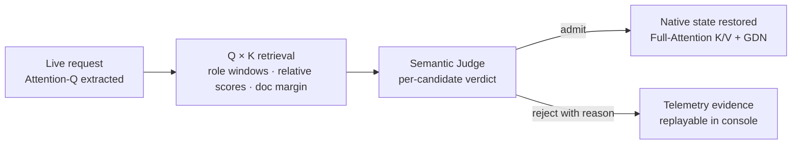

<div align="center">
  
  <h1>QWEN-EXO booster</h1>
  <p><strong>Make Qwen actually remember knowledge, reflect on mistakes, and run fast on long tasks.</strong></p>
  <p>Model-native knowledge · Reflection Memory · Semantic gating · Full observability</p>
  <p>
    
    
    
    
    
  </p>
  <p><a href="README.md">简体中文</a> · <strong>English</strong></p>
  
</div>

<br>

QWEN-EXO is a hybrid-attention inference backend for Qwen. Knowledge is wired into model attention instead of stuffed into the prompt. Lessons are distilled by the server after each success or failure instead of written by hand. Every recall, review, and injection is inspectable.

> Runs on macOS and Linux (use WSL on Windows). Supports Qwen3.5 through Qwen3.8, compatible derivative checkpoints, and MoE models. Qwen3.8-27B is recommended.

## Why not RAG

Classic RAG pastes whatever it hits back into the prompt—the bigger the store, the dirtier the context. QWEN-EXO is not another vector database strapped onto the prompt; it wires knowledge, identity, reflection, and inference control into Qwen's native forward path.

| | Classic RAG | QWEN-EXO |
|---|---|---|
| Knowledge form | Matched documents pasted into the prompt | Compiled into model-native K/V + GDN state |
| Retrieval | External embedding similarity | The model's own Attention-Q × Tensor-Bank-K |
| Admission | Inject whatever is similar | A semantic Judge reviews each candidate, rejects with reasons |
| Experience | None, or hand-written prompts | Distilled automatically from real trajectories, hot-updated |
| Observability | Black box | Telemetry evidence for every recall / rejection / injection |

Every capability has its own boundary: individually toggleable, auditable, and traceable.

## The knowledge path of one request



QK only nominates; the semantic Judge decides. Candidates with low scores, weak margins, wrong task scope, or a negative verdict are rejected—with the reason and telemetry evidence preserved.

## Core capabilities

### Model-native knowledge: Markdown is long-term knowledge

Write technical docs, project rules, API references, or team experience as Markdown; the knowledge base is built at startup. QWEN-EXO never pastes the whole store into every request: it queries with model-native Attention-Q × Tensor-Bank-K, filters candidates with role windows, relative scores, and document margins, then hands them to a semantic Judge. Only genuinely relevant, well-evidenced content is injected—**a bigger knowledge base does not mean a dirtier context**.


### Reflection Memory: every failure becomes the next run's head start

At task end or client context compaction, the server analyzes retained real trajectories in segments, checking each issue's actions, observations, mechanism, competing explanations, and counterevidence. Every lesson links to inspectable original events and is classified as **causally verified, supported by evidence, or unresolved**. Entries with checkable sources, useful experience, and explicit applicability boundaries may become eligible for Knowledge publication (`active`) without a verified root cause. Supported or unresolved lessons retain observations, hypotheses, conditional suggestions, and missing evidence; admission does not turn them into confirmed root causes or mandatory rules.

Successfully analyzed segments can be reused, while failed or uncovered portions can be retried. Lessons retain entry-level versions, and insufficient new evidence cannot overwrite a verified rule. **Analysis completion, task success, and long-term-memory admission are three different states.**

Only published Knowledge documents join ordinary Knowledge recall. Records without a `document_path` remain unindexed; eligibility does not mean publication or actual recall. Different questions may pass semantic review through the same underlying problem or applicable mechanism without repeating the original task wording. Topic overlap alone is insufficient, and selection is not guaranteed. Applying a lesson still requires checking current conditions, its scope, and unresolved evidence gaps.


### Identity, policy, and knowledge in separate lanes

Identity should not dissolve into task history. QWEN-EXO splits personality, PolicyData, Cognition, factual knowledge, and reflection memory into independent lanes: personality steadily shapes behavior, execution policy continuously constrains tool use, and task knowledge is recalled only when needed. Switching tasks never erases identity; loading identity never means pasting a manual back into the context. The control, knowledge, and task planes are each inspectable, replaceable, and reversible.

| Lane | Contents | Delivery |
|---|---|---|
| Factual knowledge | Markdown compiled into the bank, recalled on demand | native K/V + GDN state |
| Reflection lessons | Distilled after task outcomes, hot-written back | native K/V + GDN state |
| Execution policy (PolicyData) | Versioned team rules and tool discipline | text instructions |
| Identity (Cognition) | Stable identity layer, isolated from task history | text instructions |
| Session-initial GDN | Global snapshot built at startup, pinned COW per session | GDN recurrent state |

### Not prompt stuffing: context stays available

Classic RAG pays for every hit by pasting the document back into the prompt. QWEN-EXO's model-native K/V, GDN/DeltaNet state, and text instructions work in layers: memory that can be expressed as native state is not copied into natural language, and text carries only what must be explicitly readable. This is not an "infinite context" claim—it keeps the finite context for the current task, the latest tool results, and the evidence the model actually needs to read.

### Attention Bias: bounded and audited, not blind amplification

Score Bias can surface relevant system rules, tool traces, and history to the attention path, but it is not a permanent memory amplifier. QWEN-EXO supports shadow observation, relevance thresholds, maximum weights, task scope, and fallback policies: watch what the model would pick first, then decide whether to enable bias. Every candidate, weight, rejection, and actual pick is checkable via telemetry.

### Think truncation, tool boundaries, and incomplete-response recovery

Long reasoning and multi-round tool calls break at boundaries: truncations, half tool calls, leaked reasoning. QWEN-EXO keeps reasoning, tool calls, tool outputs, and final answers strictly separate, and provides a controlled recovery path for incomplete responses. Even when the model stops at a budget boundary, a half-finished internal thought is never passed off as the final answer.

### Observability: no black-box magic

Which queries ran, which K matched, which candidates the Judge rejected, whether native state was used, whether thinking was truncated—everything is visible in the console and telemetry. Performance gains are measurable, wrong recalls are locatable, reflection memory is reversible—**an unverified "the model seems to remember" is never treated as fact**.


### Conversation attention diagnostics: develop and debug Agents

**Debug an Agent without guessing from its final answer alone.** When adjusting system prompts, tool-output length, or history-cropping strategies, import a real conversation and inspect how Full Attention weights at selected input positions are distributed across messages and token blocks. Use these inspectable clues to guide context design, then validate changes against actual task outcomes.

- **Direct imports**: upload an exported conversation or select retained server history / a session saved in the current browser, without manually assembling messages.
- **Finer inspection**: select a message boundary or the first N tokens; combine per-message weight bars, the block heatmap, and source-text views to distinguish a long tool result's total share from its mean share per token.
- **Bounded conclusions**: high weight does not establish that a rule was understood, and low weight does not prove it was ignored. Diagnostics help form debugging hypotheses; they do not replace task verifiers or end-to-end A/B evaluation.

The console's **Attention diagnostics** page accepts ChatML text, `messages` JSON, Responses `input`, or Completions `prompt`. Preview the upload, crop at a message boundary, then explicitly run sampling. Uploads are limited to 2 MiB and cropped prompts to 32768 tokens. Each run samples 1–4 input positions near the end. By default, up to four representative layers are evenly selected from the model's actual Full Attention layers, spanning the earliest to the final layer; alternatively, select 1–4 layers manually. IDs are zero-based and exclude GDN layers; models with fewer than four eligible layers use all of them. Switch layers to inspect message/tool-content shares, mean share per token, and paginated heatmaps without cross-layer averaging. Changing query position preserves the selected layer. Color scales are calculated per layer, so compare raw percentages across layers. More layers increase sampling computation and response size.

Preview uses the active model template and tokenizer to show the selected message range's actual token count and effective limit, disabling Run while oversized. Select fewer messages or explicitly choose **Use first N tokens**; even an oversized first message can be diagnosed as a bounded prefix. Token cropping preserves the original encoded prefix without decoding/re-encoding or adding closing markers, and the page states how many suffix tokens are excluded. Cropped results do not represent the full conversation and may end inside a message.

Select a recent retained server conversation or browser session to import directly into preview without exporting a file. Server sources contain retained events/trajectories, not generated reflection lessons; browser sources contain only the history saved in that browser. Missing, purged, or truncated history is labeled partial and never fabricated. Import does not automatically run diagnostics.

Diagnostics use isolated internal target-only requests: no tool execution, reflection publication, native-memory injection, training, or attention-bias changes. Raw ChatML/completion prefixes are preserved; structured tool content is projected into identity-bearing text. Multimodal control markers in JSON messages are replaced with inert text placeholders and an explicit warning; actual image, audio, or video data is never read or analyzed, so this is not an exact multimodal request replay. The diagnostic feature does not persist conversations or analysis results.
Raw ChatML/completion input containing multimodal control markers is rejected to preserve the exact-prefix contract; use `messages` JSON for an explicitly warned text projection instead. Control markers inside structured tool arguments are also converted to inert placeholders.


The heatmap reconstructs Full Attention from post-RoPE Q and actual cached K, applying per-head softmax and averaging query heads. It excludes GDN and does not measure understanding or causal contribution. FP8 quantization can differ from fresh K used by fused prefill kernels. CUDA Triton/FlashInfer with standard NHD KV caches and eager prefill are supported; decode CUDA Graph settings remain unchanged. Unsupported topologies, cache layouts, or prefill graph modes fail explicitly rather than substituting retrieval scores.

The block heatmap shows **sampled query positions × contiguous token blocks**, with 16/64/256-token blocks and either total mass or mean per sampled token. For a given layer, block size and metric, all queries and blocks share one scale that does not change with pagination. Select a cell to inspect source text, sampled count, mass, mean and peak, and navigate the matching query's token view. Unsampled blocks are distinct from measured zeros. Attribution separately lists source bodies, marker-like text outside bodies, whitespace, other text of unconfirmed origin, cross-boundary tokens and invalid spans. All original weights and a total-weight check are retained; non-body text is not universally labeled template, and probabilities are not presented as understanding or causal contribution.

Endpoints: `POST /qwen-exo/attention-diagnostics/preview` and `POST /qwen-exo/attention-diagnostics/run`. Both the control plane and model workers must load a supporting version; updating static assets alone does not activate sampling.

## Measured

### DeepSWE memory recall · GraphQL SWE: perfect score after 18 rounds

| Round | F2P | P2P | partial | reward | Notes |
|---:|---:|---:|---:|---:|---|
| r1 | 12/17 | 811/811 | 0.993961 | 0 | First round |
| r2 | 3/17 | 810/811 | 0.981884 | 0 | Regression |
| r3 | 13/17 | 811/811 | 0.995169 | 0 | Recovery |
| r4 | 14/17 | 811/811 | 0.996377 | 0 | |
| r6 | 13/17 | 811/811 | 0.995169 | 0 | |
| r8 | 10/17 | 811/811 | 0.991546 | 0 | |
| r9 | 13/17 | 811/811 | 0.995169 | 0 | |
| r10 | 14/17 | 810/811 | 0.995169 | 0 | P2P regression |
| r11 | 16/17 | 811/811 | 0.998792 | 0 | Closest to perfect before r18 |
| r12 | 16/17 | 810/811 | 0.997585 | 0 | P2P regression |
| r13 | 15/17 | 811/811 | 0.997585 | 0 | |
| r14 | 15/17 | 810/811 | 0.996377 | 0 | P2P regression |
| r15 | 15/17 | 810/811 | 0.996377 | 0 | P2P regression |
| r16 | 15/17 | 810/811 | 0.996377 | 0 | P2P regression |
| r17 | 16/17 | 811/811 | 0.998792 | 0 | Final DSL `initialCount` gap |
| **r18** | **17/17** | **811/811** | **1.000000** | **1** | **Perfect score ✓** |

### DFLASH inference acceleration

DFLASH speculative decoding is supported; Qwen3.8-27B measures close to **4×** token output.

Accelerator model: [z-lab/Qwen3.8-27B-DFlash2](https://huggingface.co/z-lab/Qwen3.8-27B-DFlash2)

### Honest limits

Requests still have a context ceiling. QK retrieval can be wrong, which is exactly why the Judge and rejection reasons exist. Reflection memory is external memory, not parameter learning, and its value depends on trajectory quality. Experimental features (e.g. Context Integrity) are off by default and load only when `QWEN_EXO_EXPERIMENTAL_CONTEXT_INTEGRITY=1` is set at startup (or `--qwen-exo-experimental-context-integrity` is passed).

## Quickstart

### CUDA

```bash
bash scripts/qwen_exo/build_image.sh
```

See `docker/compose.yaml` (service `sglang`) for orchestration. `scripts/qwen_exo/launch_js4090.sh` is a complete two-GPU launch example; adjust the flags for your machine.

### Apple Silicon

No Docker, no CUDA—native MLX:

```bash
bash scripts/qwen_exo/install_mlx.sh
export QWEN_EXO_MODEL_PATH=/path/to/Qwen3.8-27B
export QWEN_EXO_DATA_PATH=/path/to/qwen-exo-runtime
bash scripts/qwen_exo/launch_mlx.sh
```

## Console

The console listens only on `127.0.0.1` by default. Do not expose it to the public Internet. Tunnel it locally:

```bash
ssh -N -L 30000:127.0.0.1:30000 <gpu-user>@<gpu-host>
```

Then open `http://127.0.0.1:30000/qwen-exo/`.

| Entry | Purpose |
|---|---|
| `/qwen-exo/` | Chat and runtime status |
| `/qwen-exo/admin` | Operations |
| `/qwen-exo/recall-trace` | Recall traces |
| Reflection Memory | View, re-reflect, hot-update lessons |

## API

OpenAI-compatible.

```bash
curl --no-buffer http://127.0.0.1:30000/v1/responses \
  -H 'Content-Type: application/json' \
  -d '{
    "model": "duckgpt",
    "input": "Explain how this service restores hybrid-attention state.",
    "stream": true,
    "max_output_tokens": 256
  }'
```

```bash
curl http://127.0.0.1:30000/qwen-exo/knowledge                    # knowledge base
curl 'http://127.0.0.1:30000/qwen-exo/recall-trace?limit=10'      # recall traces
curl 'http://127.0.0.1:30000/qwen-exo/telemetry?limit=100'        # telemetry
```

## Local verification

Without loading the production model:

```bash
PYTHONPATH=python python -m pytest test/registered/qwen_exo -q
```

Build the console:

```bash
cd frontend/qwen-exo && npm ci && npm run build
```

GPU preflight:

```bash
python3 scripts/qwen_exo/check_cuda.py
python3 scripts/qwen_exo/check_imports.py
python3 scripts/qwen_exo/check_kernels.py
python3 scripts/qwen_exo/smoke_contracts.py
```

## Layout

```text
python/qwen_exo_booster/             runtime, memory pipeline, Judge, Observer, API
python/sglang/                       inference engine and scheduler integration
scripts/qwen_exo/                    build, launch, preflight, smoke, evaluation tools
scripts/qwen_exo/corpus/knowledge/   factual and reflection knowledge sources
scripts/qwen_exo/corpus/policydata/  versioned PolicyData source
scripts/qwen_exo/corpus/cognition/   optional Cognition source
docker/                              Dockerfile and deployment configuration
frontend/qwen-exo/                   React / Vite console
test/registered/qwen_exo/            regression tests
```

## License

Apache-2.0. Built on a customized SGLang fork.
