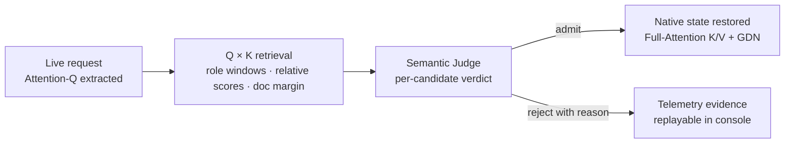
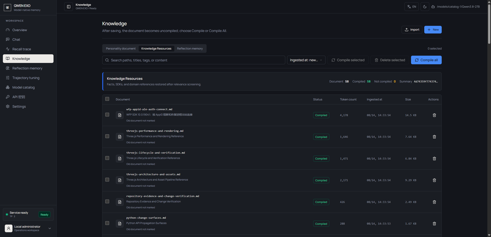
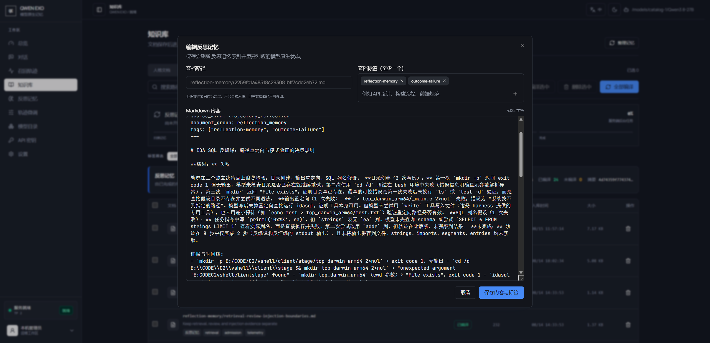
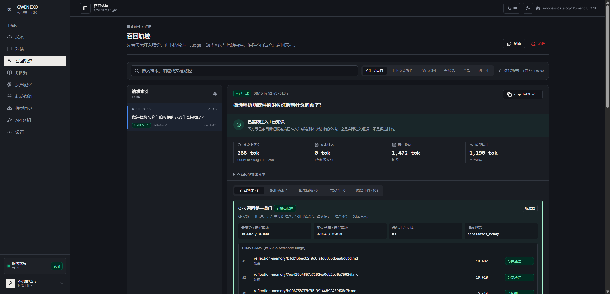

<div align="center">
  
  <h1>QWEN-EXO booster</h1>
  <p><strong>Make Qwen actually remember knowledge, reflect on mistakes, and run fast on long tasks.</strong></p>
  <p>Model-native knowledge · Reflection Memory · Semantic gating · Full observability</p>
  <p>
    
    
    
    
    
  </p>
  <p><a href="README.md">简体中文</a> · <strong>English</strong></p>
  
</div>

<br>

QWEN-EXO is a hybrid-attention inference backend for Qwen. Knowledge is wired into model attention instead of stuffed into the prompt. Lessons are distilled by the server after each success or failure instead of written by hand. Every recall, review, and injection is inspectable.

> Runs on macOS and Linux (use WSL on Windows). Supports Qwen3.5 through Qwen3.8, compatible derivative checkpoints, and MoE models. Qwen3.8-27B is recommended.

## Why not RAG

Classic RAG pastes whatever it hits back into the prompt—the bigger the store, the dirtier the context. QWEN-EXO is not another vector database strapped onto the prompt; it wires knowledge, identity, reflection, and inference control into Qwen's native forward path.

| | Classic RAG | QWEN-EXO |
|---|---|---|
| Knowledge form | Matched documents pasted into the prompt | Compiled into model-native K/V + GDN state |
| Retrieval | External embedding similarity | The model's own Attention-Q × Tensor-Bank-K |
| Admission | Inject whatever is similar | A semantic Judge reviews each candidate, rejects with reasons |
| Experience | None, or hand-written prompts | Distilled automatically from real trajectories, hot-updated |
| Observability | Black box | Telemetry evidence for every recall / rejection / injection |

Every capability has its own boundary: individually toggleable, auditable, and traceable.

## The knowledge path of one request


```mermaid
flowchart LR
    A["Live request<br/>Attention-Q extracted"] --> B["Q × K retrieval<br/>role windows · relative scores · doc margin"]
    B --> C["Semantic Judge<br/>per-candidate verdict"]
    C -->|admit| D["Native state restored<br/>Full-Attention K/V + GDN"]
    C -->|reject with reason| E["Telemetry evidence<br/>replayable in console"]
```

QK only nominates; the semantic Judge decides. Candidates with low scores, weak margins, wrong task scope, or a negative verdict are rejected—with the reason and telemetry evidence preserved.

Semantic review uses two fixed options: `A=pass`, `B=reject`. Each candidate requires one prefill, reading both token logprobs at the same answer position. Admission requires `log P(A) > log P(B)` (equivalent to a pass score above 0.5 after a two-option softmax); ties reject. There is no third semantic option, generated review text/JSON, or autoregressive Judge fallback. Scoring failures or misaligned results admit nothing, are not cached, and retain an execution-failure marker. Candidates are reviewed independently; existing Q×K ranking, scope checks, and injection budgets remain in force. This removes review-answer decoding, not prefill, and the scores are not calibrated correctness probabilities. Reflection text and compaction summaries keep their existing generation paths.

## Core capabilities

### Model-native knowledge: Markdown is long-term knowledge

Write technical docs, project rules, API references, or team experience as Markdown; the knowledge base is built at startup. QWEN-EXO never pastes the whole store into every request: it queries with model-native Attention-Q × Tensor-Bank-K, filters candidates with role windows, relative scores, and document margins, then hands them to a semantic Judge. Only genuinely relevant, well-evidenced content is injected—**a bigger knowledge base does not mean a dirtier context**.



### Reflection Memory: every failure becomes the next run's head start

At task end or client context compaction, the server analyzes retained real trajectories in segments, checking each issue's actions, observations, mechanism, competing explanations, and counterevidence. Every lesson links to inspectable original events and is classified as **causally verified, supported by evidence, or unresolved**. Entries with checkable sources, useful experience, and explicit applicability boundaries may become eligible for Knowledge publication (`active`) without a verified root cause. Supported or unresolved lessons retain observations, hypotheses, conditional suggestions, and missing evidence; admission does not turn them into confirmed root causes or mandatory rules.

Final admission reuses the internal binary semantic-scoring path: read logprobs for `A=pass` and `B=reject` at the same answer position, and mark an entry `active` only when `log P(A) > log P(B)`; ties reject. This scoring generates no tokens and does not substitute a generated JSON verdict. The preceding structured analysis only records evidence grades, explanations, and exact merge/retirement proposals. `verified`, fixed observation counts, an empty missing-evidence list, and proof booleans are no longer hard admission requirements. Quotes must still match real sources, and target identities and versions must match. Execution failures remain distinct from semantic rejection and are not cached as reviewed results.

Successfully analyzed segments can be reused, while failed or uncovered portions can be retried. Lessons retain entry-level versions. Replacing or retiring an old entry requires binary model approval of the complete old entry together with the proposed change. Review policy and model identity participate in result-reuse keys, so old-policy cached verdicts cannot masquerade as new binary reviews. **Analysis completion, task success, and long-term-memory admission are three different states.**

Global initial GDN includes admitted `active` reflections, not only `verified` ones; candidates and retired entries are excluded. Its input and consolidated reflection preserve evidence grades, applicability, missing evidence, and conditional wording. Whole entries are packed within the budget without promoting supported experience to established causation. Existing active memories retain their original admission provenance; no new binary-review records are fabricated for them.

Only published Knowledge documents join ordinary Knowledge recall. Records without a `document_path` remain unindexed; eligibility does not mean publication or actual recall. Different questions may pass semantic review through the same underlying problem or applicable mechanism without repeating the original task wording. Topic overlap alone is insufficient, and selection is not guaranteed. Applying a lesson still requires checking current conditions, its scope, and unresolved evidence gaps.



### Identity, policy, and knowledge in separate lanes

Identity should not dissolve into task history. QWEN-EXO splits personality, PolicyData, Cognition, factual knowledge, and reflection memory into independent lanes: personality steadily shapes behavior, execution policy continuously constrains tool use, and task knowledge is recalled only when needed. Switching tasks never erases identity; loading identity never means pasting a manual back into the context. The control, knowledge, and task planes are each inspectable, replaceable, and reversible.

| Lane | Contents | Delivery |
|---|---|---|
| Factual knowledge | Markdown compiled into the bank, recalled on demand | native K/V + GDN state |
| Reflection lessons | Distilled after task outcomes, hot-written back | native K/V + GDN state |
| Execution policy (PolicyData) | Versioned team rules and tool discipline | text instructions |
| Identity (Cognition) | Stable identity layer, isolated from task history | text instructions |
| Session-initial GDN | Global snapshot built at startup, pinned COW per session | GDN recurrent state |

### Not prompt stuffing: context stays available

Classic RAG pays for every hit by pasting the document back into the prompt. QWEN-EXO's model-native K/V, GDN/DeltaNet state, and text instructions work in layers: memory that can be expressed as native state is not copied into natural language, and text carries only what must be explicitly readable. This is not an "infinite context" claim—it keeps the finite context for the current task, the latest tool results, and the evidence the model actually needs to read.

### Attention Bias: bounded and audited, not blind amplification

Score Bias can surface relevant system rules, tool traces, and history to the attention path, but it is not a permanent memory amplifier. QWEN-EXO supports shadow observation, relevance thresholds, maximum weights, task scope, and fallback policies: watch what the model would pick first, then decide whether to enable bias. Every candidate, weight, rejection, and actual pick is checkable via telemetry.

### Think truncation, tool boundaries, and incomplete-response recovery

Long reasoning and multi-round tool calls break at boundaries: truncations, half tool calls, leaked reasoning. QWEN-EXO keeps reasoning, tool calls, tool outputs, and final answers strictly separate, and provides a controlled recovery path for incomplete responses. Even when the model stops at a budget boundary, a half-finished internal thought is never passed off as the final answer.

### Observability: no black-box magic

Which queries ran, which K matched, which candidates the Judge rejected, whether native state was used, whether thinking was truncated—everything is visible in the console and telemetry. Performance gains are measurable, wrong recalls are locatable, reflection memory is reversible—**an unverified "the model seems to remember" is never treated as fact**.



### Conversation attention diagnostics: develop and debug Agents

**Debug an Agent without guessing from its final answer alone.** When adjusting system prompts, tool-output length, or history-cropping strategies, import a real conversation and inspect how Full Attention weights at selected input positions are distributed across messages and token blocks. Use these inspectable clues to guide context design, then validate changes against actual task outcomes.

- **Direct imports**: upload an exported conversation or select retained server history / a session saved in the current browser, without manually assembling messages.
- **Finer inspection**: select a message boundary or the first N tokens; combine per-message weight bars, the block heatmap, and source-text views to distinguish a long tool result's total share from its mean share per token.
- **Bounded conclusions**: high weight does not establish that a rule was understood, and low weight does not prove it was ignored. Diagnostics help form debugging hypotheses; they do not replace task verifiers or end-to-end A/B evaluation.

The console's **Attention diagnostics** page accepts ChatML text, `messages` JSON, Responses `input`, or Completions `prompt`. Preview the upload, crop at a message boundary, then explicitly run sampling. Uploads are limited to 2 MiB and cropped prompts to 32768 tokens. Each run samples 1–4 input positions near the end. By default, up to four representative layers are evenly selected from the model's actual Full Attention layers, spanning the earliest to the final layer; alternatively, select 1–4 layers manually. IDs are zero-based and exclude GDN layers; models with fewer than four eligible layers use all of them. Switch layers to inspect message/tool-content shares, mean share per token, and paginated heatmaps without cross-layer averaging. Changing query position preserves the selected layer. Color scales are calculated per layer, so compare raw percentages across layers. More layers increase sampling computation and response size.

Preview uses the active model template and tokenizer to show the selected message range's actual token count and effective limit, disabling Run while oversized. Select fewer messages or explicitly choose **Use first N tokens**; even an oversized first message can be diagnosed as a bounded prefix. Token cropping preserves the original encoded prefix without decoding/re-encoding or adding closing markers, and the page states how many suffix tokens are excluded. Cropped results do not represent the full conversation and may end inside a message.

Select a recent retained server conversation or browser session to import directly into preview without exporting a file. Server sources contain retained events/trajectories, not generated reflection lessons; browser sources contain only the history saved in that browser. Missing, purged, or truncated history is labeled partial and never fabricated. Import does not automatically run diagnostics.

Diagnostics use isolated internal target-only requests: no tool execution, reflection publication, native-memory injection, training, or attention-bias changes. Raw ChatML/completion prefixes are preserved; structured tool content is projected into identity-bearing text. Multimodal control markers in JSON messages are replaced with inert text placeholders and an explicit warning; actual image, audio, or video data is never read or analyzed, so this is not an exact multimodal request replay. The diagnostic feature does not persist conversations or analysis results.
Raw ChatML/completion input containing multimodal control markers is rejected to preserve the exact-prefix contract; use `messages` JSON for an explicitly warned text projection instead. Control markers inside structured tool arguments are also converted to inert placeholders.


The heatmap reconstructs Full Attention from post-RoPE Q and actual cached K, applying per-head softmax and averaging query heads. It excludes GDN and does not measure understanding or causal contribution. FP8 quantization can differ from fresh K used by fused prefill kernels. CUDA Triton/FlashInfer with standard NHD KV caches and eager prefill are supported; decode CUDA Graph settings remain unchanged. Unsupported topologies, cache layouts, or prefill graph modes fail explicitly rather than substituting retrieval scores.

The block heatmap shows **sampled query positions × contiguous token blocks**, with 16/64/256-token blocks and either total mass or mean per sampled token. For a given layer, block size and metric, all queries and blocks share one scale that does not change with pagination. Select a cell to inspect source text, sampled count, mass, mean and peak, and navigate the matching query's token view. Unsampled blocks are distinct from measured zeros. Attribution separately lists source bodies, marker-like text outside bodies, whitespace, other text of unconfirmed origin, cross-boundary tokens and invalid spans. All original weights and a total-weight check are retained; non-body text is not universally labeled template, and probabilities are not presented as understanding or causal contribution.

Endpoints: `POST /qwen-exo/attention-diagnostics/preview` and `POST /qwen-exo/attention-diagnostics/run`. Both the control plane and model workers must load a supporting version; updating static assets alone does not activate sampling.

### Server session management

The **Server sessions** console page (`#/server-sessions`) supports conversation-ID search, pagination, single deletion, cross-page selection, and clear-all. It shows update time, event count, estimated retained payload bytes, snapshot count, and busy status. Deletion requires explicit confirmation; clear-all ignores the current search and page. Sessions with active requests or source-writing reflection work are conservatively skipped without interrupting inference.

Deletion removes the conversation's retained event journal, all source snapshots, and in-memory trajectories/pending reflection sources. These records are then unavailable for diagnostic import or re-reflection. Published Reflection/Knowledge documents, personality, Tensor Bank, serving Responses state, and browser chat history remain unchanged. This is not a complete privacy purge of telemetry, analysis caches, or backups. SQLite free pages remain reusable, but files may not immediately shrink. Future client requests that resend history can create new retained records.

Endpoints: `GET /qwen-exo/server-sessions?limit=25&offset=0&q=` and `POST /qwen-exo/server-sessions/delete`, accepting either `{"conversation_keys":["conversation ID"]}` or `{"all":true}` and returning deleted, skipped-busy, and missing lists. These belong to the existing control plane, not the public `/v1` gateway, and require a supporting backend version.

## Measured

### DeepSWE memory recall · GraphQL SWE: perfect score after 18 rounds

| Round | F2P | P2P | partial | reward | Notes |
|---:|---:|---:|---:|---:|---|
| r1 | 12/17 | 811/811 | 0.993961 | 0 | First round |
| r2 | 3/17 | 810/811 | 0.981884 | 0 | Regression |
| r3 | 13/17 | 811/811 | 0.995169 | 0 | Recovery |
| r4 | 14/17 | 811/811 | 0.996377 | 0 | |
| r6 | 13/17 | 811/811 | 0.995169 | 0 | |
| r8 | 10/17 | 811/811 | 0.991546 | 0 | |
| r9 | 13/17 | 811/811 | 0.995169 | 0 | |
| r10 | 14/17 | 810/811 | 0.995169 | 0 | P2P regression |
| r11 | 16/17 | 811/811 | 0.998792 | 0 | Closest to perfect before r18 |
| r12 | 16/17 | 810/811 | 0.997585 | 0 | P2P regression |
| r13 | 15/17 | 811/811 | 0.997585 | 0 | |
| r14 | 15/17 | 810/811 | 0.996377 | 0 | P2P regression |
| r15 | 15/17 | 810/811 | 0.996377 | 0 | P2P regression |
| r16 | 15/17 | 810/811 | 0.996377 | 0 | P2P regression |
| r17 | 16/17 | 811/811 | 0.998792 | 0 | Final DSL `initialCount` gap |
| **r18** | **17/17** | **811/811** | **1.000000** | **1** | **Perfect score ✓** |

### DFLASH inference acceleration

DFLASH speculative decoding is supported; Qwen3.8-27B measures close to **4×** token output.

Accelerator model: [z-lab/Qwen3.8-27B-DFlash2](https://huggingface.co/z-lab/Qwen3.8-27B-DFlash2)

### Honest limits

Requests still have a context ceiling. QK retrieval can be wrong, which is exactly why the Judge and rejection reasons exist. Reflection memory is external memory, not parameter learning, and its value depends on trajectory quality. Experimental features (e.g. Context Integrity) are off by default and load only when `QWEN_EXO_EXPERIMENTAL_CONTEXT_INTEGRITY=1` is set at startup (or `--qwen-exo-experimental-context-integrity` is passed).

## Quickstart

### CUDA

```bash
bash scripts/qwen_exo/build_image.sh
```

See `docker/compose.yaml` (service `sglang`) for orchestration. `scripts/qwen_exo/launch_js4090.sh` is a complete two-GPU launch example; adjust the flags for your machine.

Internal work inherits its parent's scheduling class. Query Probe, Judge, and Refresh required by the current request remain foreground; reflection and its children use an independent one-slot lane, while maintenance uses an independent three-slot lane. Memory organization has its own FIFO queue rather than sharing its organization lock with per-conversation reflection. Background descendants cannot promote themselves to foreground; cancellation, expiry, and completion release admission. Logical lanes do not add physical GPU capacity: KV, Mamba, and request-slot limits still apply. Foreground can preempt background, never the reverse.

On single-stage, non-speculative CUDA scheduling, background prefill yields at chunk boundaries to interleave foreground prefill/decode while retaining the same chunk owner and full reflection input/output budgets. Short foreground prefills can fit between chunks; longer inputs exceeding the remaining chunk budget may still wait for the current background prefill to finish. This is not immediate switching for arbitrary prompt lengths. Set `QWEN_EXO_CHUNKED_PREFILL_SIZE=2048` to tune chunks and, for a six-request deployment, `QWEN_EXO_CUDA_GRAPH_MAX_BS=6`, keeping decode graphs `full` and prefill graphs `disabled`. Requests above captured sizes still use eager execution. Verify mixed workloads and actual decode-graph logs rather than inferring latency gains from configuration.

An unmerged LoRA can run as a fixed model profile. Set `qwen_exo_runtime_lora` in a separate model directory's `config.json`, with `schema: 1`, the adapter `name`, its `path` relative to the model directory, and `file_hashes` containing SHA-256 values for `adapter_config.json` and either `adapter_model.bin` or `adapter_model.safetensors`. Keep original weights unchanged; never edit hard-linked checkpoint files in place. The configuration participates in model identity, and adapter hashes are checked at startup. `service_launcher` loads one adapter; TokenizerManager binds every external and internal request to it before batch normalization. Selecting another adapter or dynamically loading/unloading adapters cannot bypass the profile identity. Changing the adapter requires a new profile and restart, rebuilding native state rather than reusing another adapter's GDN/KV. Single-GPU dense Qwen with online FP8 base weights, an independent rank-4 LoRA, FlashInfer, and six-request decode-graph capture has been exercised; this does not establish quantization accuracy or improved model capability.

### Optional Engram table

`QWEN_EXO_ENGRAM_PATH` selects a packaged Engram artifact: an additional residual injection on the Qwen3.5 path, distinct from Flash-Next native PLE. The frozen base table and reader are not modified in place. An additional trained sparse table and reader can be packaged independently; unwritten rows return zero. Injection uses a letter-token whitelist, excluding digits, symbols and formatting tokens.

Responses requests may set `qwen_exo_engram=false` to disable all Engram, or only `qwen_exo_engram_knowledge=false` to disable the additional trained table while retaining the frozen base. Separate radix labels prevent reuse across different injection states. `scripts/qwen_exo/build_knowledge_artifact.py` checks complete training coverage, frozen base/reader hashes, addressing and finite weights before packaging. Operators supply models, data, readers and training artifacts; this source release contains none of those private files and does not establish Agent-task gains.

The current live Flash-Next profile still leaves `QWEN_EXO_ENGRAM_PATH` unset. Merging the code does not activate the 27B Engram reader.

Native Flash-Next knowledge adaptation uses an independent sparse PLE delta, not the 27B reader. `scripts/qwen_exo/prepare_native_ple_data.py` offers CPU-only `--inventory`/`--prepare`/`--check`: render complete conversations with the exact native tokenizer/template, then create causal windows of at most 32768 tokens with real two-token n-gram history. Non-assistant labels are `-100`; zero-target records remain in provenance but emit no target windows. Original roles and tool history are retained. `--prior-records` freezes whole first-task prompt groups from the old heldout set; exact prompt grouping is not verified semantic task independence.

`qwen_exo_booster.native_ple_knowledge` binds model config/index, native table manifest and actual reader tensor bytes. It implements zero-initialized sparse deltas, `off`/`real`/`shuffled` lookup and artifact round trips. Shuffling permutes delta values within each hash head, never the frozen base. `scripts/qwen_exo/prepare_native_ple_job.py` records readiness and hard training gates without loading the backbone, generating, installing packages or starting training. Missing exact Qwen4Exp differentiable support or an unverified native NVFP4 backward path yields `blocked_native_training_backend`; serving success or the table's own CPU gradient does not prove full-model autograd. PPL/NLL is auxiliary: acceptance also requires matched heldout task success, knowledge-dependent decisions, tool validity and knowledge-off regression checks. Data, plans and artifacts must remain outside public source directories.

Use `--backend-python /path/to/isolated/python` for CPU-only metadata probing of an existing environment, without changing serving packages. The observed serving Transformers 5.12.1 lacks Qwen4Exp registration, while an existing isolated 5.17.0 environment includes native models. However, the latter lacks the checkpoint's `modelopt` mixed-quantization loader registration, and the generic HF NVFP4 quantizer declares `is_trainable=False`. Architecture source availability is distinct from faithful frozen-backbone activation backward for this exact mixed checkpoint; changing quantization names or training flags cannot bypass the gate.

### Qwen3.8-Flash-Next NVFP4: isolated single-GPU path

`Qwen4ExpForConditionalGeneration` uses GDN + QSA, a four-branch Gated Residual stream, and native PLE. It is not a directory-only replacement for Qwen3.5. NVIDIA's checkpoint is mixed precision: NVFP4 main routed experts, FP8 PLE, and block-FP8 MTP experts. Its runtime quantization name is `modelopt_mixed`.

```bash
export QWEN_EXO_PYTHON=/path/to/venv/bin/python
export QWEN_EXO_MODEL_PATH=/path/to/Qwen3.8-Flash-Next-NVFP4
export QWEN_EXO_DATA_PATH=/path/to/isolated-flashnext-runtime
export QWEN_EXO_TP_SIZE=1
export QWEN_EXO_QUANTIZATION=modelopt_mixed
export QWEN_EXO_KV_CACHE_DTYPE=auto
export QWEN_EXO_SCORE_BIAS_MODE=off
export QWEN_EXO_NATIVE_PLE_DISK_PATH="$QWEN_EXO_MODEL_PATH"
export QWEN_EXO_NATIVE_PLE_BACKEND=pread
export QWEN_EXO_CPU_EXPERT_PAGING=1
export QWEN_EXO_SPECULATIVE_ALGORITHM=
unset QWEN_EXO_ENGRAM_PATH
bash scripts/qwen_exo/launch_native_js4090.sh
```

PLE reads requested rows directly from the original safetensors checkpoint; the approximately 51GB table is not CPU/GPU resident. Use `pread` on POSIX or the optional `mmap` backend; this path does not depend on an uninstalled io_uring extension. CPU expert paging retains native Top-10 routing and weights, with only the current expert set resident per layer. Prefill is partitioned by actual route sets, not incorrectly treated as selecting the same ten experts for the entire batch. The launcher selects `flashinfer_cutlass`, separate shared experts, and disabled CUDA graphs for both phases.

An existing PLE table can be bound to a separate model profile without downloading NVIDIA's whole table again. Disk lookup supports original checkpoint BF16/FP8 and BF16/F16 or per-row FP8 + FP32 scales declared by `native-ple.json`. Original checkpoint FP8 retains its global checkpoint scale. External per-row FP8 is decoded into BF16 using its row scale, with the subsequent native PLE scale fixed at 1; do not apply NVIDIA's global scale again. Only table data is reused: the new model's native PLE key/value projections are loaded, not the 27B Engram reader.

```bash
python scripts/qwen_exo/build_native_ple_profile.py \
  --source /path/to/original-nvfp4-checkpoint \
  --ple-root /path/to/existing-ple/table \
  --engram-manifest /path/to/existing-ple/engram.json \
  --recovered-mtp /path/to/recovered-mtp.safetensors \
  --combined-source model-fp8-mtp-ple.safetensors \
  --output /path/to/independent-existing-ple-profile
```

The builder verifies official main-shard hashes, the MTP recovery receipt, and every PLE source shard; hard-links unchanged main/MTP files; rebuilds the index; and explicitly binds the PLE manifest SHA to the new `config.json` and model fingerprint. Startup rejects source layout/hash mismatches. `--source` must contain `download-manifest.json` and `recovered-mtp-receipt.json`. Selective MTP recovery records the immutable mirror revision, exact HTTP 206 byte ranges, and recovered-file SHA; the undownloaded combined PLE/MTP file must not be reported as passing its complete official SHA. Point both `QWEN_EXO_MODEL_PATH` and `QWEN_EXO_NATIVE_PLE_DISK_PATH` at the new profile and use a separate state directory.

On js4090, the existing 128-shard, 320001536 × 160 per-row FP8 table passed real `pread`/`mmap` CPU/CUDA lookup checks against independent safetensors decoding for 22 cross-shard, duplicate, and final-row queries. Native PLE lookup, asynchronous prefetch consumption, and actual checkpoint key/value projections were also exact. This component smoke allocated a peak of 144.88 MiB on GPU; it is not full-model memory or end-to-end generation evidence. For the first 64 original BF16 rows, existing per-row FP8/NVIDIA global-scale FP8 MSE was `4.20e-8`/`4.41e-8`; this sample does not establish whole-table precision or Agent capability.

Native Bank artifacts preserve KV/GDN, compressed QSA index keys/coordinates, and PLE short-conv/ngram state. Sparse selection retains complete compression groups and 64-token alignment. Verify commits only accepted QSA/PLE state; ordinary GDN and ReplaySSM share the same acceptance boundary. Session artifacts declare their components and reject missing parts. Use a separate model fingerprint and state directory; old compiled artifacts and 27B Engram readers are incompatible. This path requires TP/EP/PP/MoE-DP=1 and BF16/FP8 KV, rejecting old NVFP4 KV, dense Score Bias, unified-memory/disaggregation, and generic weight-offload combinations. HiCache, LMCache, and FlexKV host transfer does not yet preserve QSA/PLE state and is explicitly rejected rather than silently losing context; ordinary radix cache and Native Bank remain supported.

This is not a throughput claim: cold expert transfers and diverse prefill routes increase PCIe traffic and layout-processing work. CPU-bank admission checks the real cgroup memory limit; do not force co-residency with a memory-heavy production model. Component regressions, row-read checks, and tiny kernel smokes do not establish full-checkpoint generation. Complete weight verification and an isolated end-to-end generation gate are still required before cutover.

CPU expert-bank admission subtracts reclaimable clean file cache using `memory.stat` rather than treating all of `memory.current` as resident commitment. Shared, dirty, writeback, and locked pages are not available capacity; untouched expert reservations still accumulate, with 8GiB headroom retained. PLE stays on disk with `pread`, without full-table loading or pinning. The default BF16 GEMM branch must also check the actual GPU: SM120 does not enable SM100/103-only split-K kernels, and that capability check must not depend on a branch-local import.

When the main model fits in VRAM, set `QWEN_EXO_CPU_EXPERT_PAGING=0` and explicitly select the SM120 expert runner with `QWEN_EXO_MOE_RUNNER_BACKEND=flashinfer_cutlass`, while retaining `QWEN_EXO_NATIVE_PLE_DISK_PATH` and `pread`. This keeps main-model experts on GPU, not the full PLE table in RAM/VRAM. This combination completed full weight loading and startup warmup on js4090; CPU Top-10 paging had exceeded the 120-second document-compilation deadline. Single-layer numerical parity therefore does not establish usable throughput. Post-load PLE offload cleanup uses the shared `current_platform.empty_cache()` interface, whose import must exist on the full loading path.

With the main model GPU-resident, disk PLE supports `QWEN_EXO_CUDA_GRAPH_BACKEND_DECODE=full`; prefill must remain `disabled`. Each capture shape owns fixed BF16 PLE-row buffers. Before replay, current tokens and request-slot histories determine eager disk lookup, decoding, and buffer fill, with padded rows zeroed. The graph only reads those buffers; native forward still commits ngram/short-conv or MTP candidate state, never the eager preparation step. Real CUDA regressions cover changed tokens, reordered requests, padding, and TARGET_VERIFY numerical/state boundaries. Removing the NVMe reader's capture-time I/O rejection is not graph support.

Native MTP uses `EAGLE` with the same profile, for example `QWEN_EXO_SPECULATIVE_NUM_STEPS=3`, `QWEN_EXO_SPECULATIVE_EAGLE_TOPK=1`, and `QWEN_EXO_SPECULATIVE_NUM_DRAFT_TOKENS=4`. Point the draft path at the same profile, set `QWEN_EXO_SPECULATIVE_DRAFT_MODEL_QUANTIZATION=modelopt_mixed` and `QWEN_EXO_SPECULATIVE_MOE_RUNNER_BACKEND=triton` for its block-FP8 experts; the target remains FlashInfer CUTLASS. Qwen4 GR speculative hidden buffers require `hidden_size × hc_count` (10240 here), not 2560. Validate actual acceptance length and request latency; enabled flags are not acceleration evidence.

Compressed QSA declares `draft_extend_cuda_graph=false` because accepted lengths are dynamic. MTP draft-extend stays eager while target TARGET_VERIFY and draft decode use full graphs. QSA does not import unused DeepSeek DSV4/FlashMLA dependencies. MTP's `enable_dp_lm_head` belongs to runtime `ServerArgs`, not `ParallelContext`.

Real js4090 combination acceptance: the same idle single-request native prompt, temperature 0, and forced 128 tokens took `10.412s` under eager execution (TTFT `0.237s`, decode `12.48 token/s`). Full Graph + native MTP took `1.397s`/`1.209s` (decode `105.52`/`121.86 token/s`), with draft acceptance `0.644`/`0.699` and output per verify `2.909`/`3.122`. Live logs show `cuda graph: True`. These are short-request combined gains, not separate Graph/MTP attribution, all-task throughput, or 200K-window evidence. Mixed-precision outputs differ across before/after and repeated runs; bit-exact parity is not claimed.

A real gateway SSE Chinese arithmetic request returned the correct result in `0.82s` and ended with `response.completed`. Three concurrent arithmetic, sorting, and 12648-token marker-recall requests passed. Runtime retains `context_length=200000`, actual KV capacity `250560`, `mem_fraction_static=0.93`, 64 Mamba slots, and decode graph batches 1–5; larger batches use eager fallback. Conversation capsules are also disabled to avoid a hidden 256-token summary after each response. Knowledge, PolicyData, Reflection Memory, and compaction remain off.

Qwen4 long-history FP8 K/V uses GPU-first residency with pinned host overflow when `QWEN_EXO_HOST_KV_CACHE=1`. Startup subtracts full-logical-span QSA metadata from the existing GPU budget, then allocates a page-aligned raw GPU prefix shared by target and MTP. Only overflow slots receive host backing; no full duplicate mirror is kept. New allocations and released slots prefer GPU pages; existing host rows are not promoted by a background LRU. QSA indices, GDN/PLE states and selected working sets remain on GPU, while CUDA kernels route logical slots to the appropriate bank. A sufficient budget makes the entire raw bank GPU-resident. Prefill, target verify and draft decode retain their semantics and graph paths; accepted-row relocation uses snapshot assignments to preserve overlapping and cross-tier moves. This requires CUDA TP/EP/PP/DP=1, FP8 E4M3, NHD, native topk=1 MTP and FlashInfer TRTLLM sparse attention; generic HiCache, unified memory, disaggregation and FP4 combinations remain unsupported.

Host KV also requires `DCP=1`; unsupported decode-context parallelism is rejected. Native Bank export restores global FP8 K/V scales before inverse RoPE, and restore places BF16 activations on the logical slots' CUDA device before writing through the pool API. Scales are applied exactly once; pinned CPU backing is not mistaken for the execution device. The snapshot protocol is now `qwen-exo-native-state-bank-v2`: rebuild older artifacts rather than reusing their old scale semantics. This source fix does not assert that the live service has deployed this revision.

The six-way 200K profile retains `QWEN_EXO_MAX_RUNNING_REQUESTS=6`, `QWEN_EXO_MAX_TOTAL_TOKENS=1300032`, `QWEN_EXO_CUDA_GRAPH_MAX_BS=6`, context `200000`, native MTP and disk PLE. The current live startup budget selected 255616 valid GPU slots and 1044416 host overflow slots. Target+MTP raw K/V occupies about 3.17GiB GPU and 12.95GiB pinned host RAM; the GPU dummy page is included, while QSA metadata, GDN and workspace are separate. This is a startup-budgeted fixed split, not whole-session migration according to each request's `nvidia-smi` free-memory reading.

The mixed layout passed 88 regressions and 11 subtests. Two rounds of six long requests each consumed 199744 prompt tokens, generated 128 tokens and returned their own correct marker. Live mixed-load samples reached six running requests, with resident peaks of 845120/904640, not the previous 1199232 full-residency peak. The old result therefore does not prove the mixed layout passed that peak gate. Further tests were stopped at the user's request; the model service remains running. Evidence is under `bench/mixed-kv-20261005/{acceptance,replay-acceptance}.json`.

The following is the earlier all-host acceptance record, not peak-residency proof for the current mixed layout:

Real six-way acceptance passed: six independent namespaces each submitted 199744 tokens, generated 128 tokens, and returned their own correct marker. Samples peaked at six running requests and 1199232 resident KV tokens; corresponding logs show `cuda graph: True`. A second repeated streaming round passed the same capacity/isolation checks. Serial initial ingestion took 28.67–35.72s per history. The next six requests took about 174s end-to-end (five prefix misses required prefill); repeated streaming took 92.15–92.55s with partial prefix hits. These timings include cold prefill, queueing, and long-prefill interference with decode, not steady decode throughput. Fast hits for all six long sessions are not guaranteed. A normal gateway short answer ended with `response.completed`. Two real Response-ID branches and subsequent queries independently retained LEFT731/RIGHT842. Evidence is under `bench/six-way-host-kv-20261005/{acceptance,stream-recovery-acceptance,session-branch-acceptance}.json`.

Responses association prioritizes verified `previous_response_id`/compaction lineage, then `prompt_cache_key`, then a versioned SHA256 label of system/instruction and first-user first lines. The complete canonical-head SHA256 remains a discriminator, and radix namespaces include model identity. Equal first lines or CRCs cannot authorize mutable-state sharing. Actual KV reuse still matches the complete token prefix, and concurrent branches own separate GDN/PLE work slots. Standard Anthropic Messages has no universal conversation ID; do not infer one from `metadata.user_id` or change SGLang's existing `session_id` transport contract.

The GPU-resident combination subsequently passed real gateway `/v1/responses` streaming generation, returning a Chinese arithmetic answer and `response.completed`; the local console also completed an actual chat. For the current trial, external Knowledge, PolicyData, Reflection Memory, and external-memory-dependent Responses compaction are disabled at the user's request; source files are retained. Disabling adaptive refresh also requires the CLI-only `QWEN_EXO_CONTEXT_INTEGRITY_MODE=off`, otherwise startup validation fails and managed configuration can roll back. Confirm the live switches and `applied_revision == healthy_revision == revision`.


### Apple Silicon

No Docker, no CUDA—native MLX:

```bash
bash scripts/qwen_exo/install_mlx.sh
export QWEN_EXO_MODEL_PATH=/path/to/Qwen3.8-27B
export QWEN_EXO_DATA_PATH=/path/to/qwen-exo-runtime
bash scripts/qwen_exo/launch_mlx.sh
```

## Console

The console listens only on `127.0.0.1` by default. Do not expose it to the public Internet. Tunnel it locally:

```bash
ssh -N -L 30000:127.0.0.1:30000 <gpu-user>@<gpu-host>
```

Then open `http://127.0.0.1:30000/qwen-exo/`.

| Entry | Purpose |
|---|---|
| `/qwen-exo/` | Chat and runtime status |
| `/qwen-exo/admin` | Operations |
| `/qwen-exo/recall-trace` | Recall traces |
| Reflection Memory | View, re-reflect, hot-update lessons |

## API

OpenAI-compatible.

```bash
curl --no-buffer http://127.0.0.1:30000/v1/responses \
  -H 'Content-Type: application/json' \
  -d '{
    "model": "duckgpt",
    "input": "Explain how this service restores hybrid-attention state.",
    "stream": true,
    "max_output_tokens": 256
  }'
```

```bash
curl http://127.0.0.1:30000/qwen-exo/knowledge                    # knowledge base
curl 'http://127.0.0.1:30000/qwen-exo/recall-trace?limit=10'      # recall traces
curl 'http://127.0.0.1:30000/qwen-exo/telemetry?limit=100'        # telemetry
```

## Local verification

Without loading the production model:

```bash
PYTHONPATH=python python -m pytest test/registered/qwen_exo -q
```

Build the console:

```bash
cd frontend/qwen-exo && npm ci && npm run build
```

GPU preflight:

```bash
python3 scripts/qwen_exo/check_cuda.py
python3 scripts/qwen_exo/check_imports.py
python3 scripts/qwen_exo/check_kernels.py
python3 scripts/qwen_exo/smoke_contracts.py
```

## Layout

```text
python/qwen_exo_booster/             runtime, memory pipeline, Judge, Observer, API
python/sglang/                       inference engine and scheduler integration
scripts/qwen_exo/                    build, launch, preflight, smoke, evaluation tools
scripts/qwen_exo/corpus/knowledge/   factual and reflection knowledge sources
scripts/qwen_exo/corpus/policydata/  versioned PolicyData source
scripts/qwen_exo/corpus/cognition/   optional Cognition source
docker/                              Dockerfile and deployment configuration
frontend/qwen-exo/                   React / Vite console
test/registered/qwen_exo/            regression tests
```

## License

Apache-2.0. Built on a customized SGLang fork.
