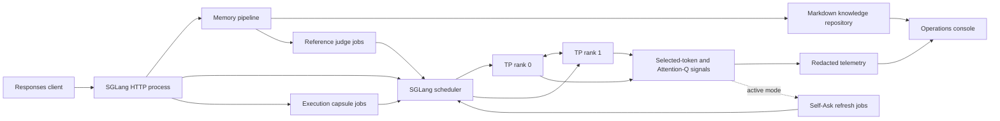

# QWEN-EXO-booster architecture

## Scope

QWEN-EXO-booster is an opt-in SGLang runtime for Qwen hybrid
Full-Attention/Gated DeltaNet models. Compatibility is structural. Qwen release
labels such as 3.5, 3.6, and 3.8 may expose the same `Qwen3_5*` runtime shell;
the launcher and `ServerArgs` therefore validate `config.json` rather than the
checkpoint directory name. The verified layouts are Dense 27B
(`Qwen3_5ForConditionalGeneration`) and MoE 35B-A3B
(`Qwen3_5MoeForConditionalGeneration`). The default deployment uses:

- one Linux host;
- two RTX 4090 GPUs;
- true SGLang tensor parallelism (`--tp-size 2`);
- BF16 weights and BF16 Mamba state;
- 64-token KV pages;
- `extra_buffer` Mamba radix-cache state;
- OpenAI-compatible `/v1/responses` semantics.

The old Transformers demo remains a behavioral oracle. Its serialized shadow
forwards, process-local GPU replicas, and recursive HTTP calls are not part of
this runtime.

## Process and data flow

### User request

1. `QwenExoRuntime.prepare_responses_request` identifies the latest user text
   and the response trajectory.
2. A previous execution capsule is restored as private instructions, when one
   exists.
3. `MemoryPipeline` ranks Knowledge and PolicyData Markdown candidates in
   physically separate lanes.
4. `ReferenceJudge` sends one constrained JSON decision job per candidate as a
   shared-prefix scheduler batch. Invalid output is ineligible.
5. Eligible Knowledge may be rendered as private, untrusted reference text.
   Eligible PolicyData is never appended to `instructions`: the highest-ranked
   page is bound to its precompiled Full-Attention K/V plus complete Gated
   DeltaNet recurrent/conv state. PolicyData state takes the single recurrent
   state slot ahead of Knowledge native restore.
6. SGLang prepends only the 64-token-aligned cache identity tokens, restores the
   rank-local state atomically, and admits the user prompt. The policy source
   text is not rendered into the request.
7. Selected-token log probability plus last-Full-Attention-layer Q signals are
   returned through SGLang's `customized_info` channel, correlated by request
   ID rather than mutable batch position.
8. At terminal completion, an execution-capsule update is submitted as a hidden
   scheduler job. Disconnect/cancel propagates to owned internal jobs.

### In-flight refresh

The observer has `off`, `shadow`, and `active` modes. A selected-token
surprisal window can trigger refresh directly. Attention-Q drift triggers only
when a complete local/history window also shows relative uncertainty growth;
this prevents a large geometric shift with stable confidence from causing a
refresh. Both paths remain subject to cooldown and per-request trigger limits.
Active refresh is a separate feature flag and requires `active` observer mode.
The refresh controller:

1. creates a constrained `submit_self_question` JSON tool call from the task
   and current trajectory, then validates its single `question` argument;
2. ranks Knowledge against that question and PolicyData against the unchanged
   original task, with a bounded candidate budget per lane;
3. applies the same fail-closed reference judge to both lanes and reuses only
   exact, valid `(model, question, candidate, reference)` decisions;
4. generates a source-bound Self-Answer when factual Knowledge is eligible;
5. otherwise, when operational PolicyData is eligible, records the constrained
   critique for routing/telemetry but does not return it as request text;
6. an admitted Knowledge checkpoint may follow a direct tool observation or be
   deferred to the next safe turn. PolicyData is always deferred to the request
   pipeline, re-judged, and restored through its native K/V plus GDN state. No
   PolicyData source, reflection, or reminder is appended to `instructions`.

No DeltaNet state is swapped in the middle of a decode step.

## State contracts

### Hybrid state

`HybridStateHandle` is the logical identity for a request prefix. Its reuse
fingerprint includes model, tokenizer, dtype, TP geometry, page size, token
boundary, and namespace. Reuse requires both complete Full-Attention KV and
complete recurrent/conv state. Fork, eviction, suspension, restoration, and
release reject illegal state transitions.

### External memory

Markdown source files are authoritative. Candidate metadata contains digests,
not public source text. A document is admitted only when its current digest
matches and its current-turn `EligibilityDecision` is `ELIGIBLE`. A stale,
missing, malformed, or unjudged reference is excluded.

Knowledge and PolicyData have different injection contracts:

- Knowledge may use a private textual reference attachment. The exact rendered
  token span supplies the observer's memory-energy proxy.
- PolicyData has no textual fallback. One highest-ranked eligible policy page is
  bound to a model-native Bank artifact containing every Full-Attention layer's
  selected raw K/V and the complete GDN Section Delta. The scheduler restores
  both components under one radix identity or fails closed.
- Native prefixes are allocator-page aligned. A PolicyData source shorter than
  64 tokens is padded only inside the offline Bank compilation prompt; no pad or
  policy text is appended to the user request.
- One request has one recurrent GDN state. Multiple eligible policies therefore
  do not get mixed: only the highest-ranked page is active and telemetry reports
  that exact document/page. Arbitrary DeltaNet-state composition is prohibited.

For a textual Knowledge attachment, the final Full-Attention layer accumulates
a K centroid over the exact attachment span. During decode, the observer emits:

- selected-token surprisal, $-\log p(y_t)$;
- Q RMS magnitude;
- request-stable Q cosine drift from the previous observed token;
- a memory-energy **proxy**, the normalized cosine alignment between current Q
  and the external-memory K centroid.

The proxy is deliberately named as such: it is not a materialized softmax
attention matrix and does not claim exact attention mass.

### Internal jobs

Judge, Self-Ask, Self-Answer, and capsule work use
`GenerateReqInput` directly. Self-Ask additionally uses the grammar backend
with a strict JSON Schema; it no longer parses a language-sensitive text
prefix.
They never call the HTTP API. Every job has a parent request, deadline,
priority, cancellation token, token/state budgets, visibility marker, and a
recursion depth fixed at zero. Parent token reserve is cumulative until the
request finishes.

### Stateless Responses agents

Some Responses clients resend the complete conversation on every model call and tag `function_call_output` items with `role=user`. QWEN-EXO treats the first non-tool user item as the stable task question; tool output remains an observation for post-tool refresh and never replaces that question.

The runtime binds each tool event to the stable task plus its type, call ID, and output digest. A bounded process-local LRU admits every unseen event once, skips replayed history, and emits `post_tool_recall.history_deduplicated` counts without text. Multiple newly supplied tool outputs may be judged, but a later rejected result does not erase an earlier eligible injection. Once replayed full history is observed, redundant per-response capsule generation is skipped because that client is not linking turns with `previous_response_id`.

Internal batches from all parents also share one process-wide condition. Capacity is reserved atomically before scheduler submission, released on completion/cancellation, and bounded by each waiting batch's deadline.

### Request-local context evidence

When post-tool Knowledge candidates are rejected, the runtime may treat bounded
chunks of the latest direct tool observation as ephemeral `lane=context`
candidates. They pass through the same constrained reference judge and grounded
Self-Answer path. Assistant reasoning is never a context evidence source.
Context candidates are request-local: they are not written to the Tensor Bank,
causal replay, execution-capsule memory sources, or next-turn memory.
`reference_status=no_eligible_reference` remains visible even when the final
refresh status becomes `context_evidence_ready`.

`off`, `shadow`, and `active` modes support staged rollout. Shadow mode judges
context but never answers or injects it. Any context chunking, judging, or
answering failure closes only the optional fallback and leaves the outer request
running with `no_eligible_reference`.

An admitted result is injected only as `Self-question: ...` followed by
`Self-answer: ...`. There is no XML wrapper, GAP/EVIDENCE/QUESTION reflection,
or procedural commentary. PolicyData remains available to normal request
preparation but is not converted into a Self-Answer.

### Admission

`SchedulerAdmission` reserves waiting-queue KV tokens, request slots, and Mamba
slots before native allocator admission. Every TP rank votes through the CPU TP
control group; no local reservation is committed when any rank rejects. A
capacity rejection is an HTTP 429-compatible abort with code
`qwen_exo_capacity_exhausted` and `retry_after=1`.

The reservation is released immediately before `PrefillAdder` performs real
allocator work, or when a queued request is evicted, times out, or is cancelled.
Native SGLang allocation remains authoritative.

Admission also charges transient FP32 logprob workspace before allocator work. The estimate covers overlapping raw and indexed chunk logits, uses at most 512 rows, reads live CUDA free bytes independently on each rank, and subtracts at least 512 MiB of non-pool safety reserve. Concurrent reservations retain the maximum shared-scratch requirement; a missing CUDA free-memory reading fails closed.

## Failure and privacy policy

- Reference parsing and refresh failures fail closed: no unverified memory is
  attached.
- Memory preparation failure does not fail the user request; it continues
  without external evidence and records a redacted failure event.
- Telemetry redacts prompts, generated text, reasoning, references, tool
  observations/arguments, API keys, and secrets by default. Redacted fields
  retain only SHA-256 and byte count.
- Raw trace text requires explicit `--qwen-exo-telemetry-include-text` opt-in.
- Knowledge and PolicyData content/mutation endpoints are a direct loopback control plane with no bearer-token layer. Deployment must keep the service on loopback or behind a trusted operator-controlled proxy.
- The runtime never performs external learning or calls an external LLM.

## Source map

| Area | Primary files |
|---|---|
| Runtime/config | `python/qwen_exo_booster/runtime.py`, `config.py` |
| Hybrid contracts | `contracts.py`, `hybrid_state.py` |
| Knowledge/judge | `knowledge.py`, `judge.py`, `pipeline.py` |
| Internal jobs/capsules | `internal_jobs.py`, `capsule.py`, `refresh.py` |
| Observer/telemetry | `attention_signals.py`, `observer.py`, `telemetry.py` |
| Scheduler admission | `scheduler_admission.py`, `python/sglang/srt/managers/scheduler.py` |
| Qwen model signal hook | `python/sglang/srt/models/qwen3_5.py`, `qwen3_vl.py` |
| Responses integration | `serving_responses.py`, `http_server.py` |
| Admin UI/API | `router.py`, `static/admin.*` |
| Deployment | `docker/QWEN-EXO-booster.Dockerfile`, `scripts/qwen_exo/` |

## Non-goals

- llama.cpp support;
- a second full vLLM implementation;
- recursive internal agents or recursive judge/tool calls;
- invisible fallback to an external model;
- claiming quality uplift without golden/evaluation evidence.
